[TOC]

# 迁移到 C

## 输入输出

```c
printf("The sum of %d and %d is %d", a, b, a + b);
```

C 没有判断参数类型的能力，需要通过占位符指定。

| 类型 | 占位符 |
| :---: | :---: |
| `int` | `%d` | 
| `double` | `%f` |
| `char` | `%c` | 
| 指针类型 | `%p` |
| `char*` | `%s` |

此外，还有

| 类型 | 占位符 |
| :---: | :---: |
| `short` | `%hd` | 
| `long` | `%ld` |
| `long long` | `%lld` | 
| `unsigned int` | `%u` |
| `unsigned short` | `%hu` |
| `unsigned long` | `%lu` |
| `unsigned long long` | `%llu` |
| `long double` | `%Lf` |

以及

| 占位符 | 含义 |
| :---: | :---: |
| `%o` | 以八进制输出 `unsigned int`，类似地有 `%ho` `%lo` `%llo` |
| `%x` | 以十六进制输出 `unsigned int`，类似地有 `%hx` `%lx` `%llx` |
| `%X` | 同上，但字母大写 |
| `%e` | 以科学记数法输出 `double`，类似地有 `%Le` |
| `%E` | 同上，但字母大写 |
| `%a` | 以十六进制输出 `double`，类似地有 `%La` |
| `%A` | 同上，但字母大写 |
| `%g` | 取 `%f` 和 `%e` 中较短者输出 |
| `%G` | 取 `%f` 和 `%E` 中较短者输出|
| `%%` | 输出 `%`|

在 `%` 后面可以可选地依次加上**修饰、宽度、精度**的限制。

其中，修饰为：
- `-`：输出左对齐
- `+`：强制输出正号
- ` `：强制正数多输出一个空格，与负号对齐
- `#`：调整输出格式：对于整型，输出 `0` `0x` `0X` 前缀；对于浮点类型，强制输出小数点
- `0`：用 `0` 而非 ` ` 作为补齐字符

宽度为：
- 整数：指定输出的最小宽度，默认左侧补齐空格
- `*`：宽度由**该占位符对应参数前的一个额外 `int` 参数指定**，即 `printf("%*s", 5, "")` 相当于 `printf("%5s", "")`

精度为：
- `.整数`：
    - 对于整型：指定最小小数位数
    - 对于浮点类型：指定小数点后位数
    - 对于 `%g` `%G`：指定最大有效数字个数
    - 对于字符串：指定最大输出字符个数
- `.*`：精度由**该占位符对应参数前的一个额外 `int` 参数指定**

`scanf` 处理输入，它的用法和 `printf` 类似。

```c
int a;
scanf("%d", &a);    // 需要取地址，因为 C 没有引用

// 如果要输入两个数
scanf("%d%d", &a, &b);  // 它们处理输入的规则和 cin 类似

// 以及匹配语法
scanf("%d,%d", &a, &b);
```


## 其他特性

### 无参函数声明

```c
void f();    // 空参数列表意味着“可传入任何参数”

int main(void);    // 此处的 void 不是必需的，但建议写上
```

### 字符字面量、字符串字面量

字符字面量拥有 `int` 类型，而非 C++ 中的 `char` 类型。

```c
sizeof('A');   // 等价于 sizeof(int)
```

字符串字面量拥有 `char[N]` 类型，`N` 是**追加了 `\0` 后的字符串长度**，而非 C++ 中的 `const char[N]`。C 的字符串同样不允许修改，这是未定义行为。

### 循环或分支的条件

循环或分支的条件只能是表达式，不能是声明。

C 中循环和分支的条件是按语境转换到 `int` 的，而非 C++ 中的 `bool`。

### 详述类型说明符

在 C 中，若想声明并定义一个结构体，需要在类型说明符前加上详述类型说明符 `struct`

```c
struct Coord {
    int x, y;
};
Coord a;          // C 中错误，C++ 中 OK
struct Coord a;   // C 和 C++ 都合法

// 通过 typedef 避免这种啰嗦：
typedef struct {
    int x, y;
} Coord;
Coord a;   
```

### 从 `void*` 到其他指针类型的隐式转换

在 C++ 中，允许从任意指针类型 `T*` 到 `void*` 的隐式转换，但反过来不行。C 允许双向的转换，这使得

```c
int* p = malloc(sizeof(int));
```

可以正确编译。在 C++，必须加上显式类型转换才能正确编译：

```c++
int* p = (int*)malloc(sizeof(int));
```


### 内存分配

```c
void *malloc( size_t size );
void free( void *ptr );
```

`malloc` 可以分配 `size` 个字节的**未初始化**内存。`malloc` 返回一个 `void*` 指针，指向分配的内存的首地址。如果分配失败，`malloc` 返回 `NULL`。

`free` 释放 `malloc` 分配的内存。`free` 接受一个 `void*` 指针，指向要释放的内存的首地址。如果传入 `NULL`，`free` 什么也不做。


```c
int *p1 = malloc(4*sizeof(int));  // allocates enough for an array of 4 int
int *p2 = malloc(sizeof(int[4])); // same, naming the type directly
int *p3 = malloc(4*sizeof *p3);   // same, without repeating the type name
free(p1);
free(p2);
free(p3);
```

```c
void* calloc( size_t num, size_t size );
```

`calloc` 分配 `num` 个 `size` 个字节的**零初始化**的内存。由于对齐需要，实际分配的字节数可能并不严格等于 `num * size`

```c
void *realloc( void *ptr, size_t new_size );
```

重新分配给定的内存。如果 `ptr` 不是 `NULL`，它必须是一个先前由 `malloc` `calloc` `realloc` 分配且尚未被释放的指针。`realloc` 会尝试扩展或缩小给定的内存块，原有的数据（如果它仍然合法）不会被改变，扩展出的新内存的内容是未定义的。如果不可行，`realloc` 会分配一块新内存，拷贝原有的数据，并释放原先的内存。

如果 `ptr == NULL`，`realloc` 的行为等价于 `malloc(new_size)`。

如果内存空间不够，旧内存块不会被释放，`realloc` 会返回 `NULL`。


# 乱七八糟

不能在范围 `for` 循环中向 `vector` 对象添加元素，此外，任何一种可能改变 `vector` 对象容量的操作都可能使该 `vector` 对象的迭代器失效。

要想自定义类的对象可以被用于范围 `for`，必须定义此对象的 `begin()` 和 `end()` 成员函数。

`i++` 使 `i` 自增，然后将 `i` 自增之前的值（即 `i` 的初始值）作为右值返回。
`++i` 使 `i` 自增，然后将 `i` 本身作为左值返回。
提倡使用 `++i`。

类中如果**有引用类型的数据成员**，那么类的**默认复制赋值重载会被删除**。

## 未定义行为

- 非良构（ill-formed）
- 非良构而不要求诊断（ill-formed no diagnostic required）
- 实现定义行为（implementation-defined behavior）
- 未指明行为（unspecified behavior）
- 未定义行为（undefined behavior, UB）

编译器假设程序永远不会包含未定义行为。

**`char` 类型有无符号是未定义行为**

**有符号整数溢出是未定义行为**，无符号整数溢出不是未定义行为

**解引用空指针是未定义行为**

**访问未初始化变量是未定义行为**

C 标准不强制 IEEE 754，（也不强制补码）因此除以零是未定义的。

IEEE 754 规定除以零得无穷，`0/0` 除外，结果为 NaN。

```c
char *p = "wikipedia"; // valid C, deprecated in C++98/C++03, ill-formed as of C++11
p[0] = 'W'; // undefined behavior
```

```c
// Meaningless checks from real code:
// pointer p; signed int x;
if (p + 100 < p)    // ptr overflow
if (x + 100 < x)    // signed int overflow
if (!(1 << x))      // oversized shift
*p; if (p)          // null pointer dereference
if (abs(x) < 0)     // Absolute value overflow
```

## 运算符优先级

| 优先级 | 运算符 | 结合律 |
| :----: | :----: | :----: |
| 1 | 后缀运算符：`()`、`[]`、`.`、`->`、`++`、`--` | 从左到右 |
| 2 | 一元运算符：`++`、`--`、`!`、`~`、`+`、`-`、`*`、`&`、`sizeof`、`_Alignof` | 从右到左 |
| 3 | 类型转换运算符 | 从右到左 |
| 4 | 乘除法运算符：`*`、`/`、`%` | 从左到右 |
| 5 | **加减法运算符**：`+`、`-` | 从左到右 |
| 6 | **移位运算符**：`<<`、`>>` | 从左到右 |
| 7 | **关系运算符**：`<`、`<=`、`>`、`>=` | 从左到右 |
| 8 | **相等运算符**：`==`、`!=` | 从左到右 |
| 9 | **按位与运算符**：`&` | 从左到右 |
| 10 | **按位异或运算符**：`^` | 从左到右 |
| 11 | **按位或运算符**：`|` | 从左到右 |
| 12 | **逻辑与运算符**：`&&` | 从左到右 |
| 13 | **逻辑或运算符**：`||` | 从左到右 |
| 14 | **条件运算符**：`?:` | 从右到左 |
| 15 | **赋值运算符**：`=``+=`、`-=`、`*=`、`/=`、`%=`、`<<=`、`>>=`、`&=`、`^=`、`|=` | 从右到左 |
| 16 | **逗号运算符**：`,` | 从左到右 |

## 字面量的推导规则

注：整数是以数字开头的。`-2147483647` 是一个常量表达式。

十进制：`int`、`long`、`long long`（**永远都会是有符号数**）
十六进制：`int`、`unsigned`、`long`、`unsigned long`、`long long`、`unsigned long long`

例如，在 32 位机器，`2147483648` 会被推导为 `long long`，而在 64 位机器则是 `long`。

## C++ 新特性

### `if` 和 `switch` 内初始化

```c++
int i = 0;
if (i >= 0) {
    // do something
}

// 在 C++17 后：

if (int i = 0; i >= 0) {
    // do something
}
```

### `auto` 可以用在函数参数类型里了

```c++
template <typename T>
void print(T x) {
    std::cout << x << endl;
}

// 在 c++17 后：

void print(auto x) {
    std::cout << x << endl;
}

// 以及变参包的折叠表达式：

void print(auto... args) {
    ((std::cout << args << " "), ..., (std::cout << std::endl));
}
```

### 结构化绑定

```c++
// 自 C++17 起
std::map<std::string, int> mp{{"miku", 2}};
    for (auto& [str, num] : mp) {
        print(str, num);
    }
```

### 范围和视图

范围：能指示一系列元素的一对迭代器。首迭代器称为“迭代器”，尾后迭代器称为“哨位”。可以用 `std::ranges::begin(c)` 和 `std::ranges::end(c)` 获得容器 `c` 的范围迭代器和哨位。

```c++
std::vector<int> a(5);
std::iota(a.begin(), a.end(), 0);    // 填充为 {0, 1, 2, 3, 4}

std::ranges::sort(a);
std::ranges::copy_if(a, std::ostream_iterator<int>(std::cout, " "), [](int x) { return x % 2 == 1; });    // 输出 1 3 

auto it = std::ranges::find(a, 42);
```

视图可以理解成一种特殊的范围。视图不修改元素、不增加元素，只是“看”。

```c++
std::vector<int> a(5);
std::iota(a.begin(), a.end(), 0);    // 填充为 {0, 1, 2, 3, 4}

std::ranges::reverse_view v_rev{a};    // 反转
std::ranges::take_view v_take{a, 3};    // 早退（取前三个元素）
// 转换
std::ranges::transform_view v_trans{
    a,
    []int(x) { return 2 * x; }
};
// 筛选
std::ranges::filter_view v_filt{
    a, 
    [](int x) { return x & 2 == 0; }
};

std::ranges::copy(v_rev, std::ostream_iterator<int>(std::cout, ' '));  // 输出 4 3 2 1 0
```

视图生成器：

```c++
// 输入一个 int 序列 输出此序列的前 5 个整数的算术平方根
std::ranges::copy(std::views::istream<int>(std::cin) |
                      std::views::filter([](int x) { return x > 0; }) |
                      std::views::take(5) |
                      std::views::transform([](int x) { return std::sqrt(x); }),
                  std::ostream_iterator<double>{std::cout, " "});
```

## 传参时数组向指针的退化

函数参数类型设置为引用，可以**防止数组退化成指针**。

```c++
template <typename R, typename F> 
int sumIf(const R& range, const F& pred) {    // 若 R 的类型不是引用 则传入数组时发生退化
    int sum = 0;
    for (auto e : range) {
        sum += pred(e) ? e : 0;
    }
    return sum;
}
```

以上例子中的 `const R& range` 在模板实例化时就会变成 `const int(&range) [N]`。

无法将函数参数类型显式设置为数组类型，形如 `void func(int[5] arr)` 的函数签名是非法的。

## 位运算

|  运算符名  | 运算符 |                                            特点                                            |
| :--------: | :----: | :----------------------------------------------------------------------------------------: |
|   按位与   |   &    |         两操作数对应的二进制位**同为 `1` 时**结果对应的二进制位为 `1`，否则为 `0`          |
|   按位或   |   \|   |         两操作数对应的二进制位**同为 `0` 时**结果对应的二进制位为 `0`，否则为 `1`          |
|  按位异或  |   ^\   |                 两操作数对应的二进制位**不相同时**结果对应的二进制位为 `1`                 |
|   按位非   |   ~    |                     结果的每一个二进制位是操作数对应的二进制位取反的值                     |
| 左移运算符 |   <<   |                      将左操作数的二进制形式左移右操作数位，低位补 `0`                      |
| 右移运算符 |   >>   | 将左操作数的二进制形式右移右操作数位，如果原符号位为 `1`，高位补 `1`，否则高位补 `0`**\*** |

*: 大多数编译器如此规定

例如，`21 & 16` 的结果为 `16`，因为：
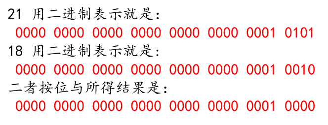

按位与可以用于**清零变量的特定位，同时保留其他位不变**，也可以用于**获取变量的特定位**。因为**和 `1` 与不变、和 `0` 与清零**。

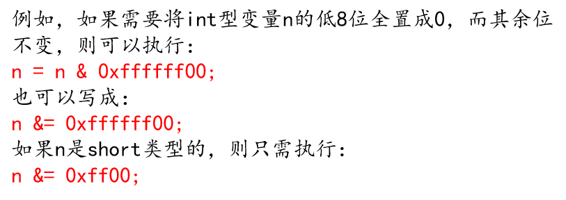

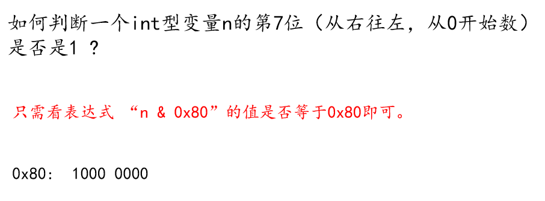

按位或可以用于**置 `1` 变量的特定位，同时保留其他位不变**。因为**和 `1` 或置 `1`、和 `0` 或不变**。

按位异或可以用于**取反变量的特定位，同时保留其他位不变**。因为**和 `0` 异或不变、和 `1` 异或取反**。

如果 `a ^ b = c`，那么 `c ^ b = a` 且 `c ^ a = b`。

## 存储期

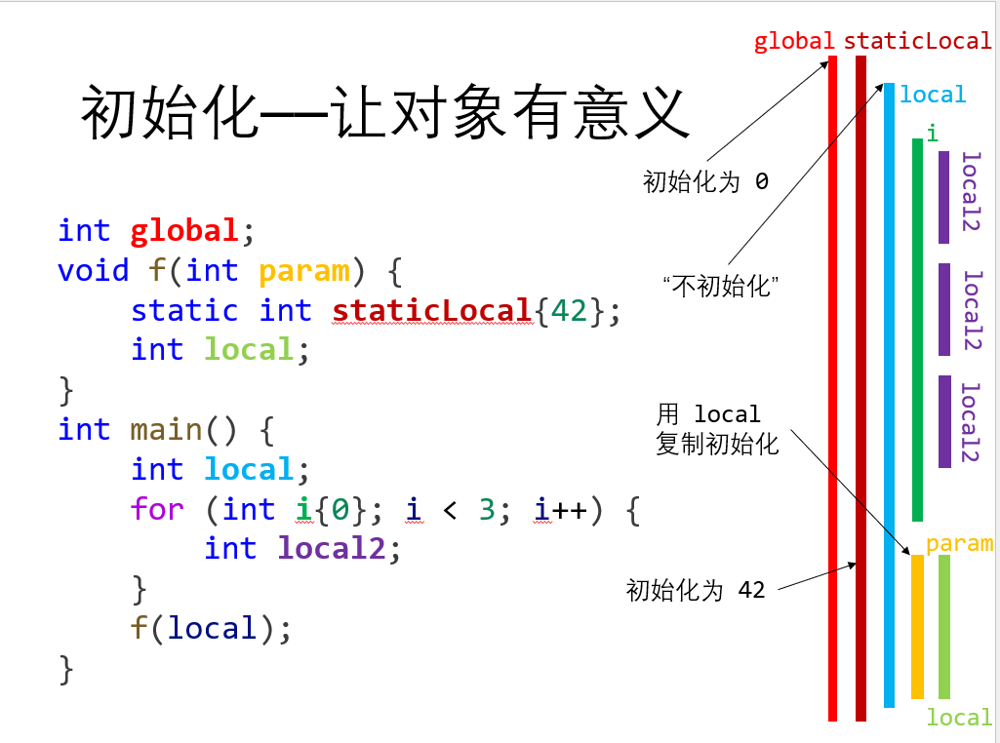

注意 `staticLocal`，它的存储期自程序开始就开始，但直到 `static int staticLocal{42};` 第一次被执行才被初始化。

- 存储期开始：内存空间诞生
- 初始化：内存空间有意义（构造）
- 存储期结束：内存空间消失（析构）

存储期也叫对象的生命周期。

## 初始化的时机

- 变量被定义
- `new`
- 函数传参
- 函数返回
- 初始化列表、默认初始化器
- 类型转换

## 值类别

C++ 中，每个表达式都具有**类型（Type）**和**类别（Category）**。

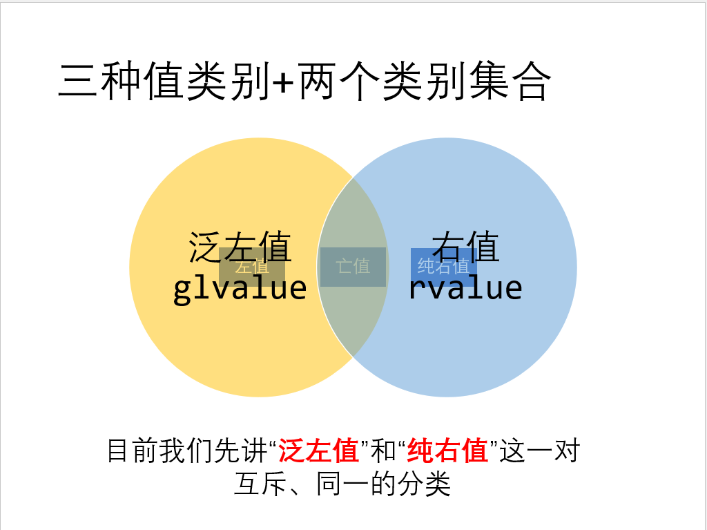

泛左值是具有身份的表达式，泛左值**具有存储空间，而且存储期比较长**，且**通常具有名字**。

泛左值包括左值和亡值。

纯右值是没有身份的表达式，纯右值**没有存储空间，没有存储期**，且**不可能有名字**，纯右值是抽象的、空洞的，作用仅仅是初始化 / 作为操作数。

纯右值可以**转换为亡值**，这一转换被称为**临时量实质化**。临时量实质化发生在**用纯右值初始化一个临时对象**的时候。

泛左值也可以**转换为纯右值**，泛左值有纯右值的所有特性，这一转换本质上就是从内存读取数据到寄存器的过程。

```c++
    int a{0}, b{1};
    int* p{&a};
    int arr[10]{};
    // 左值：
    a;
    f1(a);
    a = b;
    a += b;
    *p;
    ++a;
    arr[1];
    "Hello, world!";

    // 纯右值：
    3;
    false;
    f2(a);
    a++;
    a + b;
    !a;
    a > b;
    &a;
    this;
    [](int x) { return x; };

    a, b;  // 值类别取决于 b 的值类别
```

**只读左值引用 `const T&` 是左右通吃的**。它既可以绑定在左值上，也可以绑定在右值上（此时临时量实质化得到的对象的存储期和该引用一样长。

## C++ 风格类型转换

### `static_cast`

基本上安全的静态类型转换，可用于算术类型转换、自定义类型转换、添加指针或引用只读性的转换、枚举类型转换、**派生类到基类指针的转换**、**基类指针到派生类指针的转换**、到 `void*` 的指针转换。

`static_cast` 可能的危险：
- 算术类型**溢出**
    - “长”数转“短”数，放不下
    - 负数转换成无符号数，未定义
- **向下转型**：指向基类对象的基类指针转换到派生类指针：未定义

### `dynamic_cast`

非常安全的动态类型转换，依赖虚函数 RTTI，保证**多态类型向下转型绝对安全**。

```c++
Base* ptrOk = new Derived{};
Base* ptrBad = new Base{};

dynamic_cast<Derived*>(ptrOk);    // ok
dynamic_cast<Derived*>(ptrBad);   // ok 但得到空指针
```

`dynamic_cast` 性能比 `typeid` 要低：前者判断对象是否是某类型的子类，而后者直接判断对象是否等于某类型。`dynamic_cast` 转换到非法引用时，由于没有空引用，会抛出**异常**。

### `const_cast`

移除只读性的转换。可以移除指针或引用的只读性。

### `reinterpret_cast`

重新解释的转换。重新解释指针所指向的东西的含义。

## 数据成员指针

**数据成员指针**是指向数据成员的指针。更底层地讲，它持有某一数据成员相对于整个对象的**地址偏移量**。

```c++
class Point {
public:
    int x, y, z;
    int* ptr;
};

Point A;
auto ptrToA = &A;

// int Point::*pToX0{&(A.x)};       // error!
int Point::*pToX1{&Point::x};    // ok 数据成员指针持有的是地址偏移量 因此不用以对象定义
int ax0 = A.*pToX1;
int ax1 = ptrToA->*pToX1;
```

## `string` 操作

C 风格字符串末尾有 `\0`，但 C++ 的 `std::string` 没有。`new` 一个与 `str` 长度相同的 C 风格字符串时需要用 `new char[strlen(str) + 1];`。 

### 构造函数
- `string s(cp, n)`：`cp` 字符数组中前 `n` 个字符的拷贝
- `string s(s2, pos2)`：`string s2` 从下标 `pos2` 开始的字符的拷贝
- `string s(s2, pos2, len2)`：`string s2` 从下标 `pos2` 开始 `len2` 个字符的拷贝

从 `const char*` 构造 `string` 时，前者必须以 `\0` 结尾，除非我们指定计数值 `n`。

`s.substr(pos, n)`：返回一个 `string`，包含 `s` 从 `pos` 开始的 `n` 个（默认值 `s.size() - pos`）字符的拷贝

### 插入与删除

`insert` 和 `erase` 除支持迭代器参数外，还支持下标参数。

- `s.insert(pos, args)`：在 `pos` 前插入 `args` 指定的字符，若 `pos` 为下标，返回指向 `s` 的引用
- `s.erase(pos, len)`：删除 `pos` 起的 `len` 个字符，`len` 被忽略则删除 `pos` 起的所有字符，返回指向 `s` 的引用
- `s.assign(args)`：将 `s` 中字符替换为 `args` 指定的字符，返回指向 `s` 的引用
- `s.append(args)`：将 `args` 追加到 `s`，返回指向 `s` 的引用
- `s.replace(range, args)`：删除 `s` 中范围 `range` 的字符，替换为 `args` 指定的字符。`range` 可以是（下标，长度）也可以是（首迭代器，尾迭代器），返回指向 `s` 的引用

`args` 可以是：
- `str`：字符串
- `str, pos, len`：`str` 从 `pos` 起的最多 `len` 个字符
- `cp, len`：`cp` 指向的字符数组的前最多 `len` 个字符
- `cp`：字符数组，以 `\0` 为结尾
- `n, c`：`n` 个字符 `c`
- `b, e`：一对迭代器
- `初始化列表` 

### 查找

- `s.find(args)`：查找 `s` 中 `args` **第一次**出现的位置
- `s.rfind(args)`：逆序查找，返回**最后一次**出现的位置
- `s.find_first_of(args)`：查找 `s` 中 **`args` 的任何一个字符第一次出现的位置**
- `s.find_last_of(args)`：查找 `s` 中 **`args` 的任何一个字符最后一次出现的位置**
- `s.find_first_not_of(args)`：查找 `s` 中第一个**不在** `args` 中的字符
- `s.find_last_not_of(args)`：查找 `s` 中最后一个**不在** `args` 中的字符

`args` 可以是：
- `c, pos`：从 `s` 中 `pos` 位置开始查找字符 `c`，`pos` 默认为 `0`
- `s2, pos`：查找字符串 `s2`
- `cp, pos`：查找 `cp` 指向的字符数组，以空字符为结尾标志
- `cp, pos, n`：字符数组的前 `n` 个字符

**这些成员返回无符号类型的数**，因此最好用 `unsigned int` 等类型保存

可以通过这些成员函数的返回值编写循环，以查找子字符串出现的**所有**位置。

```c++
string name("a1b2c3d4e5");
string numbers("0123456789");
string::size_type pos = 0;
while ((pos = name.find_first_of(numbers, pos)) != string::npos) {
    cout << name[pos] << endl;
    ++pos;
}
```

### 数值转换

- `to_string(val)`：一组重载。返回数值 `val` 的 `string` 表示
- `stoi(s, p, b)`：返回 `s` 的前缀子串的数值，`b` 为转换的进制，`p` 为 `size_t` 指针，保存 `s` 中首个非数值字符的下标。`p` 默认为 `0`，`b` 默认为 `10`

类似地有 `stod` `stof` `stol` `stoul` 等等。


一个手动实现的 `sumIf`，接受一个 `int` 范围，返回其中满足 `pred` 条件的 `int` 的和：

```c++
template <typename R, typename F>
int sumIf(
    const R& range, const F& pred = [](auto) { return true; }) {
    int res = 0;
    for (auto i = std::begin(range); i != std::end(range); ++i) {
        if (pred(*i)) res = res + *i;
    }
    return res;
}
// 注意 range 的类型必须为引用，否则无法支持数组
// 可改用范围 for
```

一个手动实现的支持管道操作的过滤器，其过滤结果是一个 `std::vector`：

```c++
template <typename T>
class filter {
private:
    std::function<bool(T)> pred;
public:
    filter<T>(std::function<bool(T)> pred) : pred{pred} {}
    template <typename R>
    friend std::vector<T> operator|(const R& range, const filter<T>& filt) {
        std::vector<T> res;
        for (auto& e : range) {
            if (filt.pred(e)) res.push_back(e);
        }
        return res;
    }
};
// 如何类外定义 operator| ?
```

# 奇奇怪怪的类型

## 引用折叠

通常情况下，形参类型为**右值引用**的函数不能接受左值类型的实参。但模板是一个例外：

```c++
template <typename T>
void func(T&& x);    // func 可以接受任何类型的实参！
```

此时，若定义 `int a = 42` 并将其作为 `func` 的实参，那么编译器就会将 `T` 推断为 **`int&`** 类型。于是 `T&&` 仿佛就成为一个“左值引用的右值引用”。

此时，可以通过 `T` 确定实参的值类别：如果 `T` 是左值引用类型，那么实参是左值，如果 `T` 是普通（非引用）类型，那么实参是右值。

我们不能直接定义引用的引用，类型别名和这种情况是特例。这种情况下得到的“引用的引用”服从“引用折叠”的原则，即：

```c++
using IntLRef = int&;
using IntRRef = int&&;
// IntLRef& IntLRef&& IntRRef& 由于引用折叠 都等价于 int&
// IntRRef&& 等价于 int&&
```

可以验证这一点：

```c++
#include <type_traits>
#include <iostream>

int main() {
    std::cout << std::boolalpha;
    std::cout << std::is_same<std::remove_reference<IntLRef&>::type, int>::value << endl;
    // 输出为 true
}
```

## 转发

定义一个 `void flip(f, t1, t2)`，它将参数 `t1` `t2` 交换顺序后转发给可调用对象 `f`。

一种错误的实现：

```c++
template <typename F, typename T1, typename T2>
void flip_buggy(F f, T1 t1, T2 t2) {
    f(t2, t1);
}
// 若 f 的类型为 void(int, int&)
// 那么 flip_buggy(f, val, 42) 便违反了规约
```

利用引用折叠：

```c++
template <typename F, typename T1, typename T2>
void flip_improved(F f, T1&& t1, T2&& t2) {
    f(t2, t1);
}
// flip_improved(f, val, 42) 表现正确了（val 作为左值 使 T1 被推断为 int&，从而 T1&& 折叠成 int&）

// 然而如果 f 的类型为 void(int&&, int&) 那么 flip_improved(f, val, 42) 依然不对！
// 因为 t2 作为一个右值引用 它自身是一个左值！不能当作右值传递给 f！
```

利用 `std::forward` 实现完美转发：

`std::forward` 定义在头文件 `utility` 中，必须通过显式模板实参调用，返回其实参类型的右值引用类型。

即：`std::forward<T>` 的返回值类型是 `T&&`。

——这只是简单的理解，实际上也并不正确。总之它利用某种魔法将这件事做成了：

```c++
template <typename F, typename T1, typename T2>
void flip(F f, T1&& t1, T2&& t2) {
    f(std::forward<T2> t2, std::forward<T1> t1);
}
```

以 `t1` 为例：如果 `t1` 是左值，那么 `T1` 被推断为**左值引用类型**，`std::forward<T1>` 会返回一个“指向此左值引用的右值引用”，即返回一个左值引用类型。如果 `t1` 是右值，那么 `T1` 被推断为**普通（非引用）类型**，`std::forward<T1>` 会返回一个指向 `T1` 的右值引用，即返回一个右值引用类型。

## 指向数组的指针和引用

```c++
int a[10]{};

int (*ptrToA1)[10] = a;
auto ptrToA2 = &a;          // auto 更方便！
decltype(a) *ptrToA3 = &a;  // 也可以用 decltype

int (&refToA1)[10] = a;
auto& refToA2 = a;
decltype(a) &refToA3 = a;
```

## `const` 和指针

```c++
const int *p;        // 底层 const 指向只读变量
int const *p;        // 和上面等价
const int const *p;  // 错误！

int *const p;        // 顶层 const 指向非只读变量 自身只读
const int *const p;  // 底层 + 顶层 const
```

## 函数指针

```c++
int func(int x, char c);

// 声明
int (*ptr)(int x, char c) = nullptr;   // func 的类型的函数指针 把函数名换成 (*ptr)
decltype(&func) p{nullptr};
auto p{func};
auto p{&func};                         // 这四句等价

// 赋值
ptr = &func;
ptr = func;                           // 这两句等价 函数隐式转换为指向自身的指针

// 调用
(*ptr)(1, 'a');                           
ptr(1, 'a');                        // 这两句也等价
```

## 返回数组指针的函数

```c++
// 使用类型别名
using arrOf10 = int[10];
arrOf10* func(int x);

// 直接返回
int (*func(int x))[10];

// 使用尾置返回类型
auto func(int x) -> int (*)[10];

// 使用 decltype
int arrOfFive[]{1, 2, 3, 4, 5};
decltype(arrOfFive) *func(int x);
```

## 返回函数指针 

返回函数指针的做法和返回数组的做法类似：

```c++
// 也可以用 decltype
// 注意 函数类型和函数指针类型虽然可以转换 但是不一样的类型
int g(int, int);

decltype(&g) func(int x, int y);               // ok 返回一个函数指针
decltype(g) *func(int x, int y);               // ok 返回一个函数指针
decltype(g) func(int x, int y);                // 错误！不能返回一个函数类型 
```

```c++
int f(int x, int y) {
    return x + y;
}

int (*ReturnPtrToF1(int x, int y))(int, int) {         // 直接
    cout << x + y << endl;
    return f;
}

auto ReturnPtrToF2(int x, int y) -> int(*)(int, int) { // 尾置返回类型
    cout << x + y << endl;
    return f;
}

decltype(&f) ReturnPtrToF3(int x, int y) {            // 要么是 decltype(&f) 要么是 decltype(f) *
    cout << x + y << endl;                            // decltype(f) 是错误的！不能返回函数类型！
    return f;
}

auto ReturnPtrToF4(int x, int y) {                    // auto* 也可以
    cout << x + y << endl;
    return f;
}

int main() {
    cout << ReturnPtrToF4(1, 2)(10, 20);
}
```

## 指向函数指针的指针和函数指针数组

```c++
int f(int x, int y) {
    return x + y;
}

int (**ptr_to_ptr_to_f)(int, int);    // 指向函数指针的指针

int (*arr_of_5_ptrs_to_f[5])(int, int) // 函数指针数组

int (**func_series)(int, int) = new (int(*[5])(int, int))    // new 出来一个函数指针数组 必须在最外面加上括号
func_series[0] = f;    // 每个元素是一个函数指针

// 运用类型别名和 auto decltype
decltype(&f) *ptr_to_ptr_to_f2;                 // 指向函数指针的指针
auto *ptr_to_ptr_to_f2 = &(/*一个指向f的指针*/)  // 同上

using ptrToF = int(*)(int, int);

ptrToF* ptr_to_ptr_to_f3;                       // 同上

auto func_series2 = new ptrToF[5];           // new 一个函数指针数组
decltype(&f) *func_series3 = new ptrToF[5];  // 这两句等价
```

## lambda 表达式

```c++
auto example = [](int a, int b) -> int { return a + b; };   // 示例 尾置返回值是可选的
```

```c++
// 创建一个 h 和 g 的复合函数

int g(int a) {
    return a * a;
}
int h(int a) {
    return 3 * a;
}

auto compose0(int g(int), int h(int)) {
    return [=](int x) { return h(g(x)); };    // [=] 表示复制捕获 compose 作用域里的局部变量 g h
}

auto compose1 = [](auto g, auto h) { return [=](int x) { return h(g(x)); }; };   // 和上面等价

int main() {
    int a = 2;
    auto func = compose1(g, h);
    cout << func(a) << endl;
}
```


# 变量和基本类型

对象：一块能存储数据并具有某种类型的内存空间。指针、变量是对象，引用不是对象。

初始化：创建变量时赋予其一个初始值
赋值：**擦除**对象的当前值，以一个新值替代。

```c++
// 初始化的四种办法
int a{5};     // C++11 规定 所有数据类型均可用列表形式统一地初始化
/* 统一初始化可以让编译器进行强制检查 防止窄缩：
char c1 = 11111;    // 只警告 可以编译执行
char c2{11111};     // 错误 编译失败
char c3{100};       // ok 发生隐式类型转换
*/
int a = {5};
int b = 5;
int b(5);
```

嵌套的作用域：

```c++
int a = 42;
int main() {
    a;           // 全局变量 a
    int a = 20;  // 新定义了同名局部变量 a 覆盖了全局变量 a
    a;           // 局部变量 a
    ::a;         // 用域操作符显式访问全局变量 a （全局作用域没有名字 故域操作符左侧为空）
}
```

**如果想要声明一个变量而非定义它，添加 `extern` 关键字，且不要显式初始化变量。**
例如，`extern int i;` 是声明，而 `int j;` 是声明并定义，`extern int i = 1;` 也是声明并定义。
要在多文件中同时使用同一个变量，就必须分离声明和定义。此时，定义必须且只能出现在一个文件中（单一定义原则），其他用到此变量的文件必须对其声明，但不能重复定义。

## `const` 

`const` 类型的变量只能被初始化（且必须在声明时初始化），不能被赋值。

**`const` 类型对象是只读变量，但不一定是常量。**只读变量是**运行中值不会改变**的变量，而常量是**值在编译期就被确定**的量。初始值是一个常量表达式的 `const` 变量才一定是常量。`constexpr` 关键字修饰的对象是常量。

```c++
int getVal() {
    return 56;
}
const int a{42};        // a 是只读变量 a 也是常量
const int b{a};         // b 是只读变量 b 也是常量
const int c{a + b}   ;  // c 是只读变量 c 也是常量
const int d{getVal()};  // d 是只读变量 d **不是**常量

constexpr int e{d};     // 错误！d 不是常量
```

**默认情况下，`const` 对象是内部连接的。** 编译器会在文件内每个使用到 `const` 变量的地方将其替换为其对应的值，因此多文件编程时，每个文件都必须得能访问得到它的值才行。**不同文件中出现的同名 `const` 变量，相当于在不同文件中是分别独立的**。

如果一个 `const` 变量的初始值不是一个常量，但又需要在多文件间共享，而不是让编译器为每个文件生成独立的变量。即想要这个 `const` 对象和其他（非常量）对象一样工作：只在一个文件中定义，在其他多个文件中声明并使用。那么我们需要在 **`const` 变量的声明和定义中都添加 `extern` 关键字。**

```c++
// a.cc
extern const int b = func();  // 声明并定义
// a.h
extern const int b;           // 声明
```

指向非只读对象的指针和引用**可以隐式转换为指向只读对象的指针和引用**，反之不行。

### 引用和 `const`

所有引用都是顶层 `const` 的。`const T&` 表示对 `T` 类型变量的底层 `const` 引用。

**对 `const` 的引用既可以用只读变量初始化，也可以用任意表达式初始化，只要表达式的值能转换成引用的类型**。因此，对 `const` 的引用可能引用一个非 `const` 对象。例如：

```c++
int i = 42;
const int ci = 56;
const int& r = ci;       // ok r 绑定到 const int 类型变量 ci
const int& r1 = i;       // ok r1 绑定到 int 类型变量 i
const int& r2 = 42;      // ok r2 用字面值初始化
const int& r3 = r1 + 2;  // ok r3 用常量初始化
int& r4 = r1 + 2;        // 错误！非底层 const 的引用只能绑定到左值
int& r5 = ci;            // 错误！非底层 const 的引用不能绑定到 const int 类型变量
// 此处发生的过程参 c++ primer (5th edition) p55
```

另外，非只读变量的引用不能绑定到只读变量上，即 `int& ref = c;` 是错误的，当 `c` 是一个只读变量时。同时，对任何引用来说，引用所绑定的对象不能改变。

### 指针和 `const`

指向只读变量的指针也同理。实际上，指向只读变量的引用和指针们并不一定真正指向只读变量，只是它们自以为是地如此认为，而自发不去修改所指对象的值。

定义指针时，在**类型前**加 `const` 关键字，则得到**指向只读变量的指针（即底层 `const` 的指针）**；在类型后加 `const` 关键字，则得到**只读的指针（即顶层 `const` 的指针）**

```c++
const double pi = 3.14;
double* ptr = &pi;           // 错误！
const double* cptr = &pi;    // ok
// 同时注意 const 指针：
int n = 0;
int *const ptr1 = n;         // const 指针 其存储的地址不可改变 其指向的变量不受影响 可以改变
const int *const ptr2 = pi;  // 指向 const 变量的 const 指针
```

### 顶层 `const`

指针是对象，它又可以指向另一个对象。指针是不是只读变量和其指向的对象是不是只读变量互相独立。顶层 `const`（top-level const）表示指针本身是只读的，底层 `const`（low-level const）表示其指向的变量是只读的。这一概念可以拓展到其他类型。

注意，声明中 `constexpr` 只对指针有效，与指针所指的变量无关：

```c++
const int* p = nullptr;       // p 是指向 int 型只读变量的指针
constexpr int* q = nullptr;   // q 是一个指向 int 型非只读变量的常量指针！它是顶层 const 的！
```

## 处理类型

### 类型别名

`typedef double wages` 把 `wages` 定义成类型 `double` 的别名。

`using ll = long long` 也可以定义类型的别名。

### `auto`

`auto` 一般会忽略顶层 `const`，例如 `auto b = ci;`，当 `ci` 的类型是 `const int` 时，`b` 只是 `int` 变量。用 `const auto c = ci;` 可以解决这一问题。

```c++
int i = 0;
int &ref = i;
const int ci = 2;
const int &refToCI = ci;
auto b = ci;         // b 为 int 类型 不是只读变量
const auto cb = ci;  // cb 为 const int 类型
auto aref = refToCI; // aref 为 int 类型

auto d = ref;        // d 为 int 类型 不是引用
auto &rd = i;        // rd 为 i 的引用
const auto &crd = i; // crd 为 i 的只读引用

auto p = &a;         // p 为指向 i 的指针
auto* q = &a;        // q 也为指向 i 的指针 
```

### `decltype`

`decltype` 返回操作数的类型。它进行类型推断时的规则和 `auto` 不同。

```c++
int a = 0;
const int ca = 1;
const int& rca = ca;

decltype(a) b1 = 0;        // b1 的类型是 int
decltype(ca) b2 = 0;       // b2 的类型是 const int
decltype(rca) b3 = ca;     // b3 的类型是 const int& 

// 对表达式来说 情况稍有变化
// 一般地 若表达式的结果可以作为左值 那么 decltype 会返回表达式结果的引用类型
decltype(rca + 0) b4 = 0;  // b4 的类型是 int 因为表达式结果是右值
int *p = &a;
decltype(*p) c;            // 错误！c 被声明为 int& 类型 必须初始化
decltype((a)) d;           // 错误！d 被声明为 int& 类型 必须初始化 因为内层括号被视为了一个表达式

// decltype 不会将数组转化成指向其首元素的指针 这与 sizeof、&、typeid 类似
int arr[5]{};
decltype(arr) arr2;        // arr2 是容量为 5 的数组 
```

### 指向数组的指针和引用

```c++
int *ptrs[10];        // 这不是指向数组的指针 这是含 10 个整型指针的数组
int (*ptrToArr)[10];  // 这是指向一个有 10 个 int 元素的数组的指针

int a[10]{};
int (*ptrToA1)[10] = a;
auto ptrToA2 = &a;      // auto 更方便！
decltype(a) *ptrToA3 = &a; // 也可以用 decltype

sizeof(*ptrToA2);       // 这个值等于 40 说明这确实是指向数组的指针 而不是指向数组首元素的指针！

int &refs[10];        // 错误！没有这种语法
int (&refToArr)[10];  // 这是指向一个有 10 个 int 元素的数组的引用
```

# 异常处理

异常处理包括：

- `throw` 表达式：异常检测部分使用 `throw` 表达式表示它遇到了无法处理的问题。`throw` 引发（raise）了异常。
- `try` 语句块：以关键字 `try` 开始，以一个或多个 `catch` 子句结束。`try` 语句块抛出的异常通常会被某个 `catch` 子句处理。`catch` 子句也被称作异常处理代码。
- 一套异常类：在 `throw` 表达式和 `catch` 子句之间传递异常的具体信息。

`throw 表达式` 可以抛出一个异常。**异常是一个表达式**，可以是基本类型，也可以是一个类。

```c++
try {
    /* statements... */
} catch ( /* exception */ ) {
    /* do something with exception... */
}
```

```c++
int main() {
    double m, n;
    cin >> m >> n;
    try {
        cout << "before dividing." << endl;
        if (n == 0)
            throw -1;  // 抛出int类型异常
        else
            cout << m / n << endl;
        cout << "after dividing." << endl;
    } 
    catch (double d) {    // 捕获 double 类型的异常
        cout << "catch(double) " << d << endl;
    } 
    catch (int e) {    // 捕获 int 类型的异常
        cout << "catch(int) " << e << endl;
    } 
    catch (...) {    // 捕获任意类型的异常 必须写在最后
        cout << "catch(...) " << endl;
    }
    cout << "finished" << endl;
    return 0;
}
```

异常的抛出规则
- 异常时通过抛出对象而引发的，该对象的类型决定了应该激活哪个 `catch` 的处理代码
- 被选中的处理代码的调用链是，找到于该类型匹配且离抛出异常位置最近的那一个 `catch`
- 抛出异常对象后会生成一个异常对象的拷贝，因为抛出的异常对象可能是一个临时对象，所以会调用复制构造函数生成一个拷贝对象
  
异常的匹配规则
- 首先检查 `throw` 本身是否在try块内部，如果是，再在当前函数栈中查找匹配的 `catch` 语句。如果有匹配的直接跳到 `catch` 的地方执行
- 如果没有匹配的 `catch` 块，则退出当前函数栈，在调用函数的栈中查找匹配的 `catch` 
- 如果到达 `main` 函数的栈，都没有匹配的 `catch` ，就会终止程序
- 找到匹配的 `catch` 会直接跳到 `catch` 语句执行，执行完后，会继续沿着 `catch` 语句后面执行


C++ 标准库中有一些用于异常处理的类，`what` 是异常类提供的一个公共方法，用于返回异常产生的原因。

```c++
#include <iostream>
#include <new>
using namespace std;
int main() {
    try {
        char* p = new char[0x7fffffff];
        // 无法分配这么多空间, 抛出异常

        vector<int> v(10);
        v.at(100) = 100;
    } catch (bad_alloc& e) {
        cerr << e.what() << endl;
    } catch (out_of_range& e) {
        cerr << e.what() << endl;
    }
}
```


# 函数

## `const` 形参和实参

`const` 限定的形参既可以接受只读实参，也可以接受非只读实参，因为用实参初始化形参是会忽略形参的顶层 `const`。

```c++
int f(const int n);
int f2(int n);

int a = 5;
f(a);        // ok
f2(a);       // ok
const int b = 4;
f(b);        // ok
f2(b);       // ok

// 它们都是值传递的 
```

回顾：

```c++
int i = 42;

const int *cp = i;     // ok 底层 const 指针可以绑定到非只读对象
const int &cr = i;     // ok 同上
const int &cr2 = 42;   // ok

int *p = cp;           // 错误！
int &r = cr;           // 错误！
int &r2 = 42;          // 错误！
```

于是：

```c++
void f1(int*); 
void f2(const int*);        // 底层 const 指向对象只读

void f3(int&);
void f4(const int&);        // 底层 const + 顶层 const

void f5(int* const);        // 顶层 const 指针本身只读
void f6(const int* const);  // 底层 const + 顶层 const

int a = 42;
const int b = 56;

int main() {
    f1(&a);  // ok
    f1(&b);  // 错误！值传递后 const 被丢弃！


    f2(&a);  // ok
    f2(&b);  // ok

    f3(a);   // ok
    f3(b);   // 错误！引用传递后 const 被丢弃！

    f4(a);   // ok
    f4(b);   // ok
    f4(42);  // ok 只有 const T& 可以接受字面量

    f5(&a);  // ok 平凡
    f5(&b);  // 错误！值传递后 const 被丢弃！

    f6(&a);  // ok 
    f6(&b);  // ok 平凡
}
```

## 对象的生命周期

名字有作用域，对象有生命周期（lifetime）。生命周期是程序执行过程中对象存在的一段时间。

**自动对象**：对普通局部变量对象来说，当执行变量定义语句时，该对象被创建，到定义所在的块的末尾时，该对象被销毁。形参就是一种自动对象，我们用传递给函数的实参初始化形参对应的自动对象。

**局部静态对象**：如果有必要令局部变量的生命周期贯穿函数调用及之后的时间，可以将其定义为 `static` 类型。局部静态对象在首次执行对象定义语句时初始化，程序终止时被销毁。

```c++
size_t count_calls() {
    static size_t ctr = 0;
    return ++ctr;
}
int main() {
    for (int i = 0; i <= 10; ++i) {
        cout << count_calls() << endl;
    }
    // 输出从 1 到 10 的数字
}
```

技巧：**使用引用形参返回额外信息**  要让一个函数同时返回多个值，一种方法是定义一种新的数据类型，让它包含想要返回的数据成员，令函数返回它。另一种更简洁的做法是**传入一个额外的引用实参**，把这个引用实参当作函数的第二返回值。

## 返回数组指针

```c++
// 使用类型别名
using arrOf10 = int[10];
arrOf10* func(int x);

// 直接返回
int (*func(int x))[10];

// 使用尾置返回类型
auto func(int x) -> int (*)[10];

// 使用 decltype
int arrOfFive[]{1, 2, 3, 4, 5};
decltype(arrOfFive) *func(int x);
```

## 重载

函数重载：**同一作用域之内**名字相同但形参列表不同的多个函数。

函数的两个重载的形参列表必须相异。

**顶层 `const` 不影响传入函数的实参**：
- `int func(int);` 和 `int func(const int);` 是重复的声明。
- `int func(int*)` 和 `int func(int* const)` 也是重复的声明

**底层 `const` 影响传入函数的实参**：
- `int func(int&)` 和 `int func(const int&)` 是不重复的声明
- `int func(int*)` 和 `int func(const int*)` 是不重复的声明


虽然 `int*` 可以隐式转换为 `const int*`，但 `const int` 不能隐式转换为 `int`。因此调用重载时，指向只读对象的指针只能传递给 `const int*` 形参，而指向非只读对象的指针**优先传递给 `int*` 形参**。

## 函数指针

函数指针是指向函数的指针。

函数的类型由其形参列表和返回值类型共同确定，不同类型的函数指针不能转换。

```c++
int func(int x, char c);

// 声明
int (*ptr)(int x, char c) = nullptr;   // func 的类型的函数指针
decltype(&func) p{nullptr};
auto p(func){nullptr};
auto p(&func){nullptr};                // 这四句等价

// 赋值
ptr = &func;
ptr = func;                           // 这两句等价 函数隐式转换为指向自身的指针

// 调用
(*ptr)(1, 'a');                           
ptr(1, 'a');                        // 这两句也等价
```

返回函数指针的做法和返回数组的做法类似：

```c++
int (*func(int x, int y))(int a, int b);       // func(int, int) 的返回值类型是 int(*)(int, int)
// 也可以用 decltype
// 注意 函数类型和函数指针类型虽然可以转换 但是不一样的类型
int g(int, int);
decltype(&g) func(int x, int y);               // ok 返回一个函数指针
decltype(g) *func(int x, int y);               // ok 返回一个函数指针
decltype(g) func(int x, int y);                // 错误！不能返回一个函数类型 
```


### 高阶函数

函数指针可以作为形参（高阶函数：higher order function)

```c++
void func(int x, int y, bool g(int a, int b));    // g 看起来是函数 实际上是一个函数指针
void func(int x, int y, bool (*g)(int a, int b)); // 这两句是等价的

// 可以直接将函数作为实参使用 它会自动转换为函数指针
bool less(int a, int b) {
    return a < b;
}
func (1, 2, less);
```

```c++
int summation(int n, int term(int)) {
    /* 返回 term(1) + term(2) + ... + term(n) */
    int total = 0, k = 1;
    while (k <= n) {
        total += term(k);
        ++k;
    }
    return total;
}

int cube(int x) {
    return x * x * x;
}

int natural(int x) {
    return x;
}

int sum_cubes(int n) {
    return summation(n, cube);
}

int sum_naturals(int n) {
    return summation(n, natural);
}
```


## 函数抽象

函数的**规约（specification）**：

- 前置条件（precondition）：对输入参数的规定
- 后置条件（postcondition）：对返回值和其他额外影响的规定

通过函数的规约实现了抽象。

规约的描述方式：

- 函数签名（Function Signature）：函数名，参数类型，返回值类型
- 函数描述
 - 功能
 - 对参数的限制条件
 - 抛出的异常
 - 其他影响

查看规约要比审查实现更容易理解函数的功能。

函数设计：

- 每个函数只做一件事
- DRY 原则：Don't Repeat Yourself
- 有泛化性

## 缺省参数

定义函数时，可以给**最右边的连续若干个参数指定缺省值**，调用时，若相应实参省略，则函数会以缺省参数初始化对应的形参。

```c++
int func1(int x, int y = 42);

func(5);
```

## 内联函数

`inline` 关键字可以**建议**编译器将整个函数的代码插入到调用语句处，从而避免函数调用和返回时产生的额外开销。

就算加了 `inline`，编译器也不一定实现内联。

在函数**定义**之前添加 `inline` 关键字可以将函数设置为内联的，**只在函数声明之前加 `inline` 不会其效果**。


## Lambda 表达式

Lambda 表达式是只调用一次的简单函数。它是在被调用时才写出函数体，不需要专门命名的“匿名”函数。

它的声明方式：
`[捕获列表](参数列表) -> 返回值类型 函数体`

其中返回值类型可以省略，此时编译器自动判断返回值类型。

函数体中**可以访问全局变量，不能访问局部变量**。使用捕获列表才能访问局部变量，但**此时无法转换为函数指针**。

- []：不使用任何外部变量
- [=]：复制捕获**所有**外部变量
- [&]：引用捕获**所有**外部变量
- [x, &y]：复制捕获 `x`，引用捕获 `y`
- [=, &x, &y]：引用捕获 `x` 和 `y`，复制捕获其余变量
- [&, x, y]：复制捕获 `x` 和 `y`，引用捕获其余变量

默认情况下，**引用捕获**的变量可修改，但**复制捕获的变量不可修改**。要解除这一限制，可以使用 `mutable`：

```c++
auto func = [=] mutable (int x, int y) { return x + y; };
```

Lambda 表达式实际上是一个**重载了 `operator()` 的匿名类的对象**，空捕获的 Lambda 表达式可以隐式转换为函数指针类型。

使用 Lambda 表达式作为函数实参：

```c++
int summation(int n, int term(int)) {
    int total = 0, k = 1;
    while (k <= n) {
        total += term(k);
        ++k;
    }
    return total;
}

int sum_cubes(int n) {
    return summation(n, [](int x) -> int { return x * x * x; });
    // 作为 summation 的实参时，lambda 表达式的捕获列表只能为空
}
```

捕获列表示例：

```c++
int main() {
    int x{100}, y{200}, z{300};
    cout << [](double a, double b) { return a + b; }(1.2, 2.5) << endl;
    
    auto ff = [=, &y, &z](int n) {
        cout << x << endl;
        ++y;
        ++z;
        return n * n;
    };

    cout << ff(15) << endl;
    cout << y << ' ' << z << endl;
}
```

C++14 引入了 Generic Lambda，支持像模板一样使用 Lambda 表达式：

```c++
auto print_container = [](auto const& container) {
    for (auto& element : container) cout << element << ' ';
    cout << endl;
};
```

# 面向对象程序设计

## 补充

**类内定义的成员函数是隐式的 inline 函数。**

类的**成员函数内部可以访问当前对象的所有属性和函数**，也可以访问**同类的其他对象的所有属性和函数**。类的成员函数以外，只能访问类的对象的 `public` 成员。

编译器先编译成员的声明，之后编译成员函数体。因此在类作用域内，**成员函数可以使用在自己之后才被声明定义的数据成员**。

**对象的生命周期**：声明和定义 -> 内存分配 -> 初始化 -> 使用 -> 销毁

关于初始化：

- 全局变量：未明确初始化，则自动初始化为全 `0`
- 局部变量：未明确初始化，则初始化值随机
- 函数传参：复制初始化
- 函数返回值：自动生成临时变量（若开启返回值优化 RVO 则不生成），执行复制初始化

## 构造函数

类通过构造函数控制对象的“初始化”过程。（实际上初始化应当利用成员初始化列表和默认初始化器完成，构造函数的函数体只是做善后工作）

构造函数不能被声明成 `const` 的。只读对象在被构造函数完成其初始化之后才取得 `const` 属性，因此构造函数可以向 `const` 对象写值。

对象生成时构造函数自动被调用。对象一旦生成，就再也不能在其上执行构造函数。

### 默认构造函数

不提供初始化值时，对象将被**默认构造函数**默认初始化。

更一般地，默认初始化在：

- 在块作用域内不使用初始化值定义非静态变量或数组时
- 一个类本身含有**成员对象**，且它使用合成的默认构造函数时
- 类类型成员没有在构造函数初始化值列表中显式初始化时

发生。

而值初始化在：

- 数组初始化时，提供的初始值数量少于数组大小时
- 不使用初始化值定义局部静态变量时
- 通过形如 `T()` 的表达式显式请求值初始化时

`S();` 就是一个默认构造函数。注意，`S a;` 才是一个用默认构造函数初始化的对象的声明，`S a();` 是一个函数声明。


下例中 `array3` 的初始化与普通数组的初始化有区别。

```c++
class CSample {
    int x;
   public:
    CSample() {
        cout << "Constructor 1 Called" << endl;
    }
    CSample(int n): x{n} {
        cout << "Constructor 1 Called" << endl;
    }
};
int main() {
    CSample array1[2];
    cout << "step1" << endl;
    CSample array2[2] = {4, 5};    // 调用转换构造函数
    cout << "step2" << endl;
    CSample array3[2] = {3};       // 调用转换构造函数构造第一个元素 调用默认构造函数构造第二个元素 这和数组的初始化是不同的
    cout << "step3" << endl;
    CSample *array4 = new CSample[2];
    delete[] array4;
}
/* 输出结果：
Constructor 1 Called
Constructor 1 Called
step1
Constructor 2 Called
Constructor 2 Called
step2
Constructor 2 Called
Constructor 1 Called
step3
Constructor 1 Called
Constructor 1 Called
*/
```


### 预置默认构造函数

如果没有定义**任何**构造函数，编译器就会隐式地定义一个**预置默认构造函数**，它：
- 若类内成员**有初始化值**，则用初始化值初始化
- 否则默认初始化

**如果定义了构造函数，即使定义的不是默认构造函数，编译器也不会再定义预置默认构造函数**。因此定义构造函数后，还需要再定义默认构造函数。

可以用 `S() = default;` 要求编译器生成预置默认构造函数。

**当定义了构造函数 `Test(int n)` 时，同时也定义了从 `int` 到类 `Test` 的转换**（见“转换构造函数”）。此时语句 `Test t{Test(2)};` 由于编译器优化，不会调用复制构造函数。

构造函数重载之间不能冲突：

```c++
class S {
    int t;
    S() = default;
    S(int t=0): t{t} { }    // 错误！重载冲突！
};
```


## 复制构造函数

复制构造函数：只有一个参数，且该参数是对同类对象的引用的构造函数。

复制构造函数形如 `X::X(X&)` 或 `X::(const X&)`，其中后者可以以只读对象作为参数。不允许形如 `X::X(X)` 的构造函数。

### 预置复制构造函数

若没有定义复制构造函数，则编译器生成**默认复制构造函数**依次对每个成员**复制初始化**：

- 若为基础数据类型，则直接复制过去
- 若为结构体类型，则调用它的复制构造函数 

### 什么时候调用复制构造函数？

1. **初始化**：当用类的一个对象去初始化同一个类的另一个对象时：
    - `Complex c2(c1);`
    - `Complex c2 = c1;     // 这两句等价 这不是赋值`
     
2. **函数传参**：如果函数有一个参数是类的对象，那么该函数被调用时，就会用类的复制构造函数传参：
    ```c++
    void func(Complex c) {}
    int main() {
        Complex c1;
        func(c1);      // 传参时调用复制构造函数
    }
    ```


3. **函数返回**：若函数返回值为类的对象，则函数返回时，类的复制构造函数将会被调用（编译器可能将生成临时变量的过程优化掉）：
    ```c++
    A func() {
        A b(1);
        return b;
    }
    int main() {
        cout << func().v << endl;
    }
    ```

#### 如何赋值

注意此例！**对象间赋值不会调用复制构造函数**：

```c++
class Complex {
   public:
    double r, i;
    Complex() = default;  
    Complex(double a, double b): r{a}, i{b} {
        cout << "Constructor 1 Called" << endl;
    }
    Complex(const Complex &c) {
        cout << "Copy Constructor Called" << endl;
    }
};
Complex c1(1, 2);   // 调用构造函数 1
Complex c2;         // 调用默认构造函数
Complex c3 = c1;    // 调用复制构造函数 和上一句等价 这不是赋值 是初始化

int main() {
    c2 = c1;            // 赋值不会调用复制构造函数！
}
/* 输出：
Constructor 1 Called
Copy Constructor Called
*/
```

注意此例！这种情况会引起编译器优化，也不会调用复制构造函数！
```c++
class A {
   public:
    double r, i;
    A() = default;  
    A(double a, double b): r{a}, i{b} {
        cout << "Constructor Called" << endl;
    }
    A(const A &c) {
        cout << "Copy Constructor Called" << endl;
    }
};

A c1(10, 20);        // 调用构造函数
A c2(c1);            // 调用复制构造函数
A c3(A(100, 200));   // 编译器优化 不调用复制构造函数 调用构造函数

int main() {
    ;
}
/*输出：
Constructor Called
Copy Constructor Called
Constructor Called
*/
```

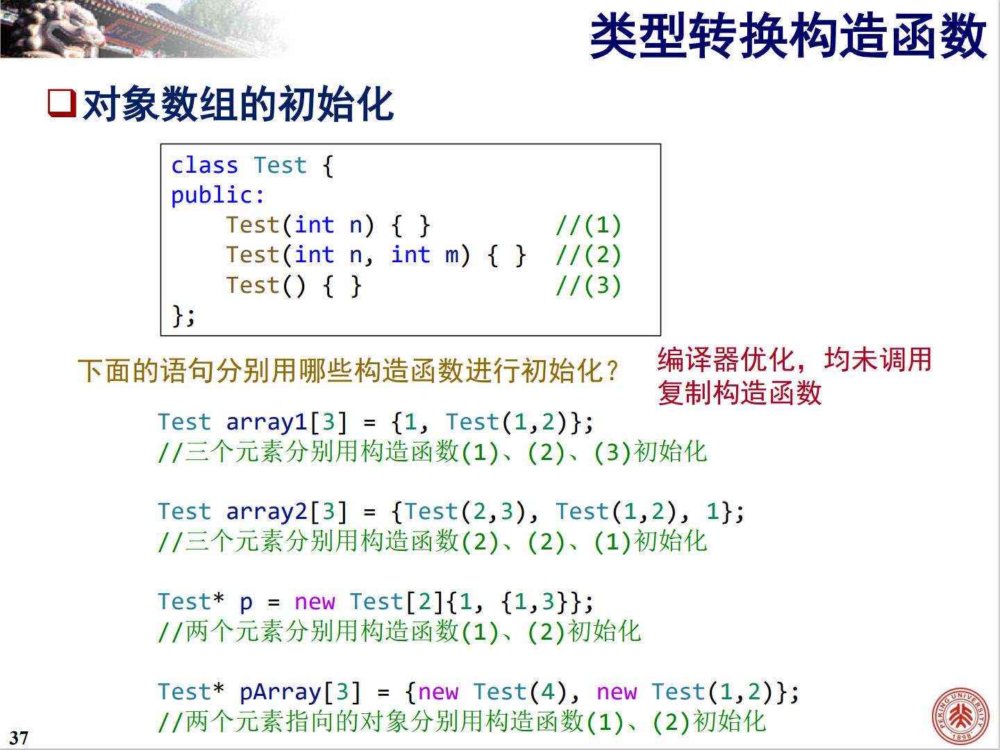


**浅复制**：成员中含有**指针**时，只复制指针的值（即指向的地址）的复制方法。复制得到的指针和被复制的指针指向同一片内存。

**深复制**：成员中含有**指针**时，不复制指针的值，另开辟一片内存空间，将指针所指的内存空间中存放的值复制到新的内存空间。复制得到的指针和被复制的指针指向不同的内存。

### 复制构造函数与 NRVO

注意此例：

```c++
class S {
   public:
    int d;
    S() = default;
    S(int d) : d{d} { cout << "cons called" << endl; }
    S(const S& s) { cout << "copy called" << endl; }
};

S getS() {
    S s(100);
    return s;
}

int main() {
    S test{getS()};
}
/*
这份代码只会输出 cons called，不会输出 copy called 说明执行时复制构造函数没有被调用
但如果删除复制构造：
*/

class S {
   public:
    int d;
    S() = default;
    S(int d) : d{d} { cout << "cons called" << endl; }
    S(const S& s) = delete;  // { cout << "copy called" << endl; }
};

S getS() {
    S s(100);
    return s;
}

int main() {
    S test{getS()};
}
/*
则会报错：use of deleted function 'S::S(const S&)'
*/
```

这个过程**涉及到两个复制构造**，一个发生在 `getS()` 函数返回时，另一个发生在 `test` 初始化时。第二个复制构造被 C++ 强制跳过，第一个复制构造被 C++ **允许跳过**（即 NRVO）。由于 NRVO 只是允许的，并不是强制的，所以在语法层面复制构造**必须要有**（否则代码就只能在开启 NRVO 的环境运行了），但在执行层面复制构造**可选（由是否 NRVO 决定）地被跳过**。整个过程中，只有在 `S s(100);` 中执行了一次构造函数，也就是说从结果上，整个过程等价于只执行 `S test(100);`。

此外，从右值复制构造会被强制优化，不需要复制构造函数。

```c++
class S {
   public:
    int d;
    S() = default;
    S(int d) : d{d} { cout << "cons called" << endl; }
    S(const S& s) = delete;
};

S getS() {
    return S{100};
}

int main() {
    S test{getS()};
}
// 这份代码可以正确地运行
```


## 析构函数

析构函数形如 `~String()`，它**没有参数和返回值**。一个类**最多只有一个析构函数**。

析构函数在**对象将消亡的时候**自动被调用，可以利用析构函数完成对象消亡前的善后工作，如释放内存空间。

若没有定义析构函数，则编译器生成缺省析构函数。它什么也不做。

例：

```c++
class Test {
   public:
    ~Test() {
        cout << "Destructor Called" << endl;
    }
};
int main() {
    Test array[2];    // 数组每个元素都会调用析构函数
}
/*
输出：
Destructor Called
Destructor Called
*/
```

例：

```c++
class Test {
   public:
    ~Test() {
        cout << "Destructor Called" << endl;
    }
};
Test obj;
Test f(Test o) {     // 第一次析构发生在参数对象消亡时
    return o;
}
int main() {
    obj = f(obj);    // 第二次析构发生在函数返回值（临时对象）消亡时
                     // 第三次析构发生在 obj 消亡时
}
/*
输出：
Destructor Called
Destructor Called
Destructor Called
*/
```


什么时候会有新对象的创建？**构造函数被调用时**。
什么时候会有对象的消亡？**析构函数被调用时**。

## 类型转换构造函数

C++ 中的隐式类型转换一般发生在：
- 用 A 类型初始化 B 类型变量时
    - 声明并定义 B 类型变量，但初始化值为 A 类型的
    - 函数形参期望 B 类型，但实参为 A 类型
    - 函数返回值期望 B 类型，但 return 了 A 类型的 
- 某个运算符期待 B 类型，但得到了 A 类型操作数
- `if` `while` `for` 语句中，将 A 类型转换到 `bool` 类型 

**构造函数可以实现类型转换**。被转换的类型和构造函数的参数类型匹配时，构造函数就会被自动调用，建立一个无名临时对象。


```c++
class Complex {
   public:
    double real, imag;
    Complex(int i) {
        real = i;
        imag = 0;
    }
    Complex(const Complex& c) {
        real = c.real;
        imag = c.imag;
    }
};

int main() {
    Complex c1(7);    // 小括号初始化，调用构造函数
    Complex c2 = c1;  // 用c1初始化c2，调用复制构造函数

    Complex c3 = (Complex)9;  // 显式类型转换，调用构造函数（编译器优化 不调用复制构造函数）生成临时对象
    Complex c4 = Complex(9);  // 显式类型转换，调用构造函数（编译器优化 不调用复制构造函数）生成临时对象

    Complex c5 = 9;  // 隐式类型转换，调用构造函数（编译器优化 不调用复制构造函数）生成临时对象

    c5 = c1;         // 赋值运算，不调用任何构造函数

    c5 = (Complex)12;  // 显式类型转换，调用构造函数生成临时对象，再进行赋值运算
    c5 = Complex(12);  // 显式类型转换，调用构造函数生成临时对象，再进行赋值运算

    c5 = 12;  // 隐式类型转换，调用构造函数生成临时对象，再进行赋值运算
}
```

### `explicit` 关键字

使用 `explicit` 修饰构造函数，可以使该构造函数**只能用于显式类型转换**，不能用于隐式类型转换。

可以用于隐式类型转换的构造函数又被称为**类型转换构造函数**。

```c++
class Complex {
   public:
    double real, imag;
    explicit Complex(int i) {
        cout << "IntConstructorcalled" << endl;
        real = i;
        imag = 0;
    }
    Complex(double r, double i) {
        real = r;
        imag = i;
    }
};

int main() {
    Complex c1(7, 8);
    Complex c2 = Complex(12);  // 显式类型转换
    c1 = 9;                    // 编译错误, 没有隐式转换构造函数
    c1 = Complex(9);           // ok，可以被显式转换
    cout << c1.real << "," << c1.imag << endl;
}
```


可以把构造函数分为三类：默认构造函数、复制构造函数、转换构造函数。


## 成员对象

成员对象：一个类的成员变量如果是另一个类的对象，那么这个成员变量就是成员对象。


例：

```c++

class CTyre {    // 轮胎类
    int radius;  // 半径
    int width;   // 宽度
   public:
    CTyre(int r, int w) {
        radius = r;
        width = w;
    }
};

class CEngine {  // 引擎类
};

class CCar {    // 汽车类
    int price;  // 价格
    CTyre tyre;
    CEngine engine;

   public:
    CCar(int p, int tr, int tw) {
        price = p;
        tyre = CTyre(tr, tw);
        // 注意，这两句是赋值，而不是初始化！
        // CCar car(1, 2, 3) 会报错！
    }
};
```

重新认识成员函数：**C++ 中，成员变量的初始化发生在调用构造函数之前。在调用构造函数的那一刻起，每一个成员都已经有了自己的初始值**。构造函数的函数体内部实际上只应该做初始化的善后工作，而不是初始化本身。

在上例中，编译器会提示“Ctyre 没有默认构造函数”就是由于这个原因。

构造函数可以附加成员初始化列表，这可以解决上述问题：

```c++
CCar(int price, int tr, int tw): price{price}, tyre(tr, tw) { }
```

- 如果构造对象时匹配上了此构造函数，则**先根据成员初始化列表执行初始化，然后执行构造函数**
- 可以用大括号统一初始化，对于成员对象，可以用小括号调用对应的构造函数初始化
- 允许函数参数名和成员变量名同名

## 对象初始化与销毁的一般流程

初始化：
1. 若某个成员在**初始化列表**被提及，则按初始化列表初始化
2. 若某个成员有默认初始化器，则按默认初始化器初始化
3. 以上两条均不满足，则默认初始化——简单类型什么也不做，类类型调用默认构造函数（若无则报错）
4. **全部初始化完成后调用构造函数**

**初始化每个成员的顺序是按照成员声明的顺序执行的，和初始化列表的书写顺序无关**

销毁时，**析构顺序和构造顺序相反**，**先调用析构函数，然后再按照成员声明顺序的逆序析构每个成员**。

### 成员对象的复制构造

若 B 有成员对象 b2，且 b2 被**默认复制构造函数**初始化，那么 b2 里面的成员对象也会被**复制构造函数**初始化。

```c++
class A {
    public:
    A() { cout << "default" << endl; }
    A(const A& a) {cout << "copy" << endl;}
};

class B {
    A a;
};

int main() {
    B b1, b2(b1);
    // b2.a 用 A 的复制构造函数初始化 而且调用复制构造函数时的实参就是 b1.a
}
/* 输出结果：
default
copy
*/
```

## 静态成员

静态成员：在定义前加了 `static` 关键字的成员。

对整个类来说，静态成员变量只有一份，静态成员变量不作用于某个具体对象。静态成员函数也不作用于某个具体对象————它也没有 `this` 指针。

静态成员除了可以通过 `对象名.成员名`、`指针->成员名` 访问以外，还可以通过 `类名::静态成员名` 访问。

静态成员本质上是一个类作用域的全局变量 / 函数，和类的其他成员没什么关系，静态成员实际上根本不算是成员。

**成员列表中的静态成员变量大多只能是声明而不能是定义**，一般**必须在类外专门对其声明并初始化**。否则编译能通过，但链接不能通过。

```c++
class A {
    static int a;   // 是声明
    // static int a{0};  默认初始化也不允许！
}
int A::a{0};       // 类外定义 不带 static
```

静态成员函数**不能访问非静态的成员变量，也不能调用非静态的成员函数（构造函数除外），没有 `this` 指针**。另外，在**类外定义**静态成员函数时**不能加上 `static`**。

静态成员函数也是类的一部分，它**可以访问类的私有构造函数**

## 只读成员 

### 只读对象 

在定义对象时加上 `const` 关键字，即可得到只读对象。只读对象及其引用可以作为函数形参。

**只读对象只能调用构造函数、析构函数、只读成员函数**。可以读取只读对象的所有成员变量，但不能修改它们，除非用 `mutable` 修饰。

### 只读成员函数

在成员函数签名后面加 `const` 关键字，即可得到只读成员函数。这实际上是**把 `this` 指针设定成了底层 `const` 的**。

只读成员函数内部**不能改变该类的成员变量的值，也不能调用该类的非只读成员函数**，但是可以调用静态成员函数（因为静态成员函数不能访问非静态的成员变量，也不能调用非静态的成员函数）。

和静态成员函数不同，只读成员函数**在声明和定义时都必须加 `const` 关键字**，以便重载。

由于只读成员函数实质上是将 `this` 指针看作形参设定成了底层 `const` 的，故**只读成员函数**与***另一个名字、参数列表相同的非只读成员函数**也构成重载。

#### 什么时候调用什么重载

```c++
class T {
public:
    int d;
    T() = default;
    T(int d) : d{d} { cout << "Constructor Called" << endl; }

    void print() const { cout << "Const Print Called" << endl; }
    void print() { cout << "Print Called" << endl; }
};

T test(6);
const T tst(42);

int main() {
    test.print();
    tst.print();
}
/*输出结果：
Constructor Called
Constructor Called
Print Called             若注释掉 print 的非只读重载，则本行也输出 Const Print Called
Const Print Called
*/
```

**只读对象只能调用只读成员函数，非只读对象可以调用只读成员函数，也可以调用非只读成员函数**。
当只读重载和非只读重载都存在时，**非只读对象优先调用非只读成员函数重载**。

#### `mutable` 成员变量

用 `mutable` 修饰的成员变量**可以在 `const` 成员函数中修改**。

### 只读成员变量

```c++
class A {
    const int data;
};
```

不能以任何方式被赋值，无论是在构造函数还是在只读成员函数中。
必须被显式初始化：**带默认成员初始化器，或者出现在构造函数成员初始化列表**。

## 友元

友元函数：类的友元函数可以访问类的**私有成员**。友元函数**可以是其他类的成员函数**。
友元类：若类 B 有友元类 A，则 A 的所有成员函数都可以访问 B 的私有成员。

声明友元：把对应的函数或类的声明用 `friend` 修饰后在类内抄一遍即可。**声明友元可在类定义的任何位置，不受访问范围关键词的约束**。

**友元类之间的关系不能传递，不能继承**。

**友元函数的定义既可以在类外，也可以在类内**。类内定义的友元函数称为**隐藏友元函数**。隐藏友元函数**在全局命名空间内不可见**，也**不能以 `类名::友元函数名` 或 `类的对象.友元函数` 的形式被调用**。它只能在**实参为该类的对象时**以 `友元函数(实参)` 的形式被调用：

```c++
class S {
public:
    int d;
    S(int d) : d{d} {}
    friend void f(S a) {
        cout << a.d << endl;
    }
};

int main() {
    S d(10);

    f(10);          // error
    S::f(10);       // error
    d.f(10);        // error
    d.f(d);         // error
    S::f(d);        // error

    f(d);        // 唯一正确的调用方法
}
```


## 运算符重载

注意：
- C++ 不允许定义新的运算符
- 重载后的运算符应符合日常习惯
- 运算符重载不能改变运算优先级
- 以下运算符**不能被重载**：
    - 作用域解析运算符 `::`
    - 成员运算符 `.`
    - 成员指针运算符 `.*`
    - 条件运算符 `?:`
    - `sizeof` `alignof` `throw` 等等
- 重载 `()`、`[]`、`->`、`=`、强制类型转换运算符时，运算符**必须重载为类的成员函数**。
- 重载流插入 / 流提取运算符时，运算符**必须重载为普通函数**。

运算符可以被重载为**类的成员函数**，也可以被重载为**普通函数**。被重载为成员函数时，参数个数为运算符目数减一。

```c++
Complex Complex::operator+(const Complex& c);    // 成员函数
Complex operator+(const Complex& c1, const Complex& c2);    // 普通函数
```

### 赋值运算符重载

**赋值运算符**只能被重载为**成员函数**。

当没有在类中定义参数为 `const 类名&` 类型的赋值运算符重载时，编译器生成**预置赋值运算符重载**（**直接浅复制每一个成员变量**），使得同类的对象之间可以赋值。

例：

```c++
class String {
    char *str;
public:
    String() : str{new char[1]} {str[0] = '\0';}
    ~String() { delete[] str; }
    String& operator=(const char* s) {      // 返回值应该是引用类型！（为了尽量和赋值号原本的特性相符）
        if (this == &s) return *this;       // 处理自赋值的情况！
        delete[] str;                       // 赋值需要先释放旧空间！
        str = new char[strlen(s) + 1];
        strcpy(str, s);
        return *this;
    }
};
```


上例没有声明类型转换构造函数 `String(const char*)` 
所以 `String s{"hello"};` 仍然会报错！

当前定义下，`String s2, s1{"aaa"}; s2 = s1;` 会在析构时报错，因为**预置赋值运算符重载**只是**浅复制**。 

**如果有了转换构造函数，那么一般不定义赋值运算符重载代码也可以运行（但可能内存泄漏！）**，因为 `s1 = "hi";` 在没有定义赋值运算符重载时，会自动调用转换构造函数进行隐式类型转换。

同时包含**类型转换构造函数**和相同类型的**赋值运算符重载**时，优先使用重载的赋值运算符。

初始化是**从零到一**的过程，执行初始化时凭空产生一个新对象。

赋值是**从一到一**的过程，执行赋值时会发生一个**抛弃旧值**的过程。

#### “复制-交换”手法

`T` 类型的复制赋值重载具有形式 `T& operator=(const T&);`，这也是编译器预置的复制赋值重载的签名。但除此之外还有一种复制赋值重载，它形如：**`T& operator=(T);`**。

这种形式的复制赋值重载常用在“复制-交换”手法中。平时定义带深复制的类时，常常需要编写两份深复制代码：一份在**复制构造函数**内，另一份在**复制赋值重载**内。“复制-交换”手法可以**避免这一重复**——由于参数是值传递（调用复制构造函数）而非引用传递，深复制已经在传参时完成，函数体内只需要**交换形参和左操作数的资源**即可完成复制赋值。

但是，“复制-交换”手法在自赋值时效率更差。

```c++
class String {
    char* data;
    int size;

public:
    ~String() { delete[] data; }
    String& operator=(String temp) {
        size = temp.size;
        data = temp.data;
        temp.data = nullptr;      // 这句很重要！防止 temp 析构时和 this->data 同归于尽
        return *this;
    }
};
```

### 类型转换重载：

**必须是成员函数，不能写返回值类型，形参为空**。一般定义为 `const`，会在隐式类型转换时自动被调用，可以加 `explicit` 关键字禁止隐式类型转换。

```c++
class Complex {
private:
    double r, i;

public:
    operator double() {
        return r;
    }
};
```

于是可以写 `double d = Complex(1, 2) + 3.14;`，此时 `Complex(1, 2)` 会自动隐式转换为 `double` 类型。

### 运算符重载为友元

一般地，将运算符重载为成员函数是较好的选择。但有时成员函数无法满足要求，例如若将 `operator+` 重载为 `Complex` 的成员函数，则对于 `Complex c;`，`c = c + 5` 可以执行，而 **`c = 5 + c` 编译报错**。

因此，有时需要将运算符重载为普通函数。若需要访问私有成员，还要将此运算符重载**声明为类的友元**：`friend Complex operator+(const Complex&, const Complex&)`。

注意，不必特地重载 `friend Complex operator+(int, const Complex&)`，因为对于 `c = 5 + c`，`5` 会先隐式转换到 `double`，然后通过类的转换构造函数 `Complex(double, double)` 转换成 `Complex`。


### 流插入 / 流提取运算符的重载

`cout` 是在 `iostream` 中定义的，`ostream` 类的对象。`ostream` 类重载了 `<<` 运算符，使得它成为了流提取运算符。

因为 `ostream` 已经被定义在标准库里了，无法在 `ostream` 类内定义新的运算符重载，所以 `<<`、`>>` 只能重载为普通函数。

示例：

```c++
class Complex {
    double real, imag;

public:
    Complex(double r = 0, double i = 0) : real(r), imag(i) {}
    friend ostream &operator<<(ostream& os, const Complex& c);
    friend istream &operator>>(istream& is, Complex&c);
};
ostream& operator<<(ostream& os, const Complex& c) {
    os << c.real << "+" << c.imag << "i";  // 以"a+bi"形式输出
    return os;
}
istream& operator>>(istream& is, Complex& c) {
    char ignore;
    is >> c.real >> ignore >> c.imag >> ignore;
    return is;
};
```

### 特殊运算符的重载

#### 自增 / 自减运算符

自增 / 自减运算符有**前置后置**之分。C++ 规定**前置运算符作为一元运算符重载，后置运算符作为二元运算符重载（多出来的参数一般没用，只是以示区分）**。

例如： 

```c++
class T {
    /* ... */
public:
    T& operator++();       // 前置自增运算符重载为成员函数
    T& operator++(int);    // 后置自增运算符重载为成员函数
};

class S { /* ... */ };

S& operator++(S s);        // 前置自增运算符重载为普通函数
S& operator++(S s, int n); // 后置自增运算符重载为成员函数
```

##### 左右值与自增运算符

一般地，前置自增运算符**先将对象的值自增，后取回值**，返回的是**自增后的值**；后置自增运算符**先取回值，后将对象的值自增**，返回的是**自增前的值**。

#### 函数调用运算符的重载

重载函数调用运算符后，可以将普通变量当作函数用。**函数调用运算符只能以成员函数的形式定义重载**。

```c++
class A {
public:
    int data;
    int operator()(int a, int b) { return data * a * b; }
};

int main() {
    A a{2};     
    cout << a(3, 5) << endl;
};
```


## 继承

UML（Unified modeling language）：统一建模语言

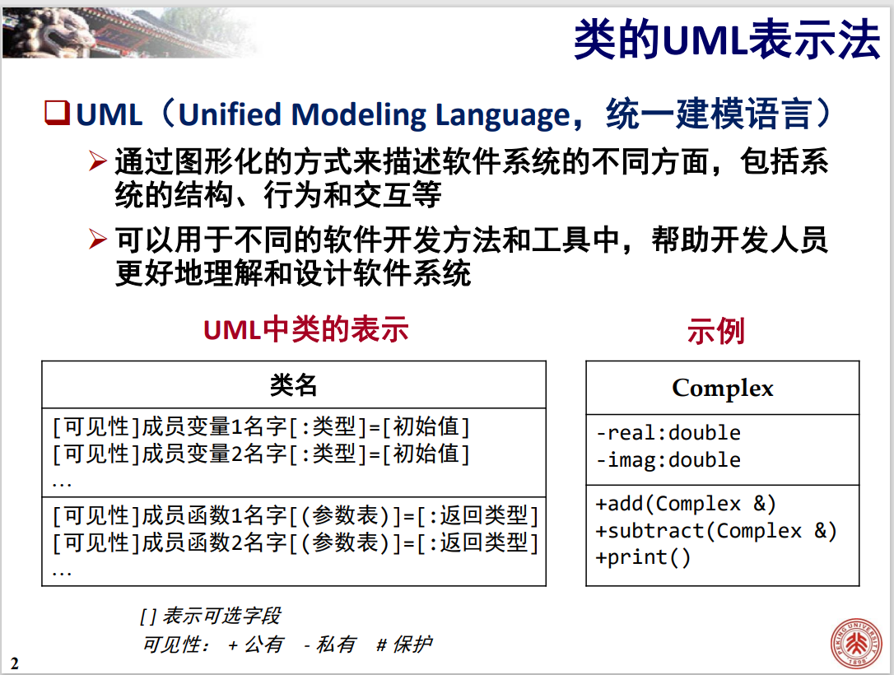

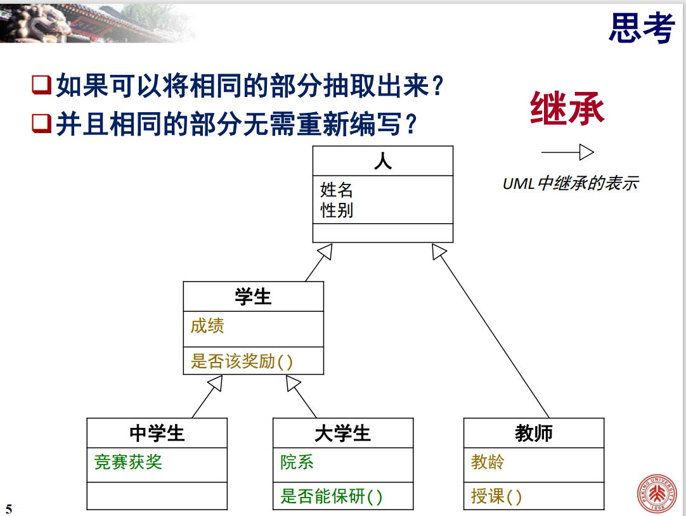

定义类 `B` 时，若 `B` 包含类 `A` 的（全部）特点，那么就不必从头重写 `B`，而可以把 `A` 作为基类，从中派生出 `B` 类，即让 `B` 继承自 `A`。

派生类是基类的扩充和修改。

派生类对象的内存空间（大致可以）分割成基类部分 + 派生类部分，且基类部分位于派生类部分之前。

派生类中可以**定义与基类成员同名的成员**，在派生类中访问与基类成员同名的成员时，缺省访问派生类中定义的成员，要访问基类中的同名成员，需要用**作用域符号 `::`**。一般地，基类和派生类不定义同名成员变量。

### 访问权限

派生类可以指定**继承方式说明符**：`public` `private` `protected`，指定**基类中的 `public` 成员在继承后的访问权限**。公有继承自基类的派生类，其基类的公有成员可以被外部访问，私有继承自基类的派生类，其基类的公有成员不能被外部访问。基类中的 `private` 成员对派生类不可见。

用 `protected` 修饰的成员称为保护成员，**基类的保护成员可以被派生类访问，但不对外公开**。

```c++
class Father {
private:
    int nPrivate;
public:
    int nPublic;
protected:
    int nProtected;
};
class Son : public Father {
    void accessFather() {
        nPublic = 1;     // ok;
        nPrivate = 1;    // error, 基类私有成员对派生类不可见
        nProtected = 1;  // OK, 访问从基类继承的保护成员
        Son s;
        s.nProtected = 1;  // OK, 访问其它同类对象的基类保护成员
        Father f;
        f.nProtected = 1;  // error, f 不是函数所作用的当前类的对象
    }
};
```

|   基类的   |       公有继承       |       保护继承       |       私有继承       |
| :--------: | :------------------: | :------------------: | :------------------: |
| 公有成员将 | 成为派生类的公有成员 | 成为派生类的保护成员 | 成为派生类的私有成员 |
| 保护成员将 | 成为派生类的保护成员 | 成为派生类的保护成员 | 成为派生类的私有成员 |
| 私有成员将 |    对派生类不可见    |    对派生类不可见    |    对派生类不可见    |

### 派生类的构造和析构

**不会被继承的成员函数**：
- 基类的构造函数
- 基类的**可访问的（公有非 `=delete`）**复制赋值运算符重载
- 基类的析构函数

定义派生类的构造函数时，通常需要**调用基类的构造函数**初始化派生类对象从基类继承来的成员。

**派生类的构造顺序**：
1. 构造基类部分的成员：如果**初始化列表**中提供了基类构造方法，则调用对应构造函数；否则**默认初始化基类**。
2. 按照**初始化列表**或者**默认初始化器**构造派生类“额外的”成员。若无，则**默认初始化**。
3. 执行派生类的构造函数。

**派生类的析构顺序**：
1. 执行**派生类的析构函数**。
2. 按与构造时相反的顺序**析构成员**。
3. 执行**基类的析构函数**。

```c++
class Base {
public:
    int n;
    Base(int i) : n(i) { cout << "Base " << n << " constructed" << endl; }
    ~Base() { cout << "Base " << n << " destructed" << endl; }
};

class Derived : public Base {
public:
    Derived(int i) : Base(i) { cout << "Derived constructed" << endl; }
    ~Derived() { cout << "Derived destructed" << endl; }
};

int main() {
    Derived t(3);
}

/* 输出结果：
Base 3 constructed
Derived constructed
Derived destructed
Derived destructed
*/
```

### 继承中的隐式转换

私有继承和保护继承不适用以下规则。

#### 派生类到基类

一个公开继承的派生类对象可以“**隐式转换**”到其基类。

“隐式转换”后的对象不包含派生类定义的成员，它相当于在派生类基础上**只保留其基类部分**得到的对象。

**从派生类构造基类**会调用基类的**复制构造**。
**用派生类赋值基类**会调用基类的**复制赋值重载**。

```c++
class Base { };
class Derived : public Base { };

void f(Base b) { };

int main() {
    Derived d;
    Base b{d};    // 调用基类的复制构造
    b = d;        // 调用基类的复制赋值重载
    f(d);         // 调用基类的复制构造
}
```

#### 基类指针和引用绑定到派生类


一个公开继承的派生类对象可以绑定到**基类对象的指针和引用**。由于这个指针 / 引用的类型仍然是基类，**这个指针 / 引用只能访问其指向对象的基类部分**。

若派生类公开继承自基类，**派生类对象**的指针可以直接赋值给**基类**指针。此后这个基类指针由于类型仍然是基类，**只能访问其指向对象的基类部分**。可以通过**强制类型转换**把指向基类的指针转换为指向派生类的指针。

```c++
class Base {
protected:
    int n;

public:
    Base(int i) : n(i) { cout << "Base " << n << " constructed" << endl; }
    ~Base() { cout << "Base " << n << " destructed" << endl; }
    void print() { cout << "Base:n=" << n << endl; }
};

class Derived : public Base {
public:
    int v;
    Derived(int i) : Base(i), v(2 * i) {
        cout << "Derived constructed" << endl;
    }
    ~Derived() { cout << "Derived destructed" << endl; }
    void func() {}
    void print() {
        cout << "Derived:v=" << v << endl;
        cout << "Derived:n=" << n << endl;
    }
};

int main() {
    Base b(5);
    Derived d(3);
    Base *pBaseToD = &d;

    // pBaseToD->func();          // error
    // pBaseToD->v = 5;           //错误，Base类没有v成员变量
    
    pBaseToD->print();            // 调用基类函数 print
    // Derived *pDerivedToB = &b; //错误

    Derived *pDerivedToB = (Derived *)(&b);
    pDerivedToB->print();         // 慎用，可能出现不可预期的错误
    // 往别人的空间里写入数据，可能引起问题
    pDerivedToB->v = 128;
    
    d.print();
}

/* 输出结果：
Base 5 constructed
Base 3 constructed
Derived constructed
Base:n=3
Derived:v=0
Derived:n=5
Derived:v=6
Derived:n=3
Derived destructed
Base 3 destructed
Base 5 destructe
*/
```

### 多继承

#### 直接基类和间接基类

若类 `A` 派生 `B`，`B` 派生 `C`，则类 `A` 是类 `B` 的直接基类，是类 `C` 的间接基类。

声明派生类时, 派生类的首部只需要列出它的直接基类，派生类沿着类的层次自动向上继承它的间接基类。

派生类的成员包括：
- 派生类自己定义的成员
- 直接基类中定义的成员
- 全部间接基类的成员

#### 多继承

一个类可以从多个基类派生而来，继承多个基类的成员，这被称为**多继承**。

```c++
class Base {
public:
    int val;
    Base() { cout << "Base Constructor" << endl; }
    ~Base() { cout << "Base Destructor" << endl; }
};

class Base1 : public Base {};
class Base2 : public Base {};
class Derived : public Base1, public Base2 {};  // 多继承

int main() { 
    Derived d;
}
/* 输出结果：
Base Constructor
Base Constructor
Base Destructor
Base Destructor
*/
```

多继承具有**二义性**。二义性发生派生类**访问基类同名成员**时。

```c++
class Base1 {
private:
    int b1;
    void set(int i) { b1 = i; }    // private
public:
    int i;
};

class Base2 {
private:
    int b2;
public:
    void set(int i) { b2 = i; }    // public
    int get() { return b2 ; }
    int i;
};

class Derived : public Base1, public Base2 {
public:
    void print() {
        cout << get();
        set(5);         // 二义性 error 即便两个 set 有访问权限的区分
        Base2::set(5);  // ok
        Base1::set(5);  // error!
    }
};
```

二义性检查在访问权限检查之前执行，因此**不能靠成员的访问权限来消除二义性**。

如果二义性的两个基类同名函数可以通过**重载**来区分，且不想每次调用时都带作用域限定符，可以用 `using` 声明：

```c++
class Base1 {
private:
    int b1;

public:
    void set(double i) { b1 = i; }
};

class Base2 {
private:
    int b2;
public:
    void set(int i) { b2 = i; }    // public
};

class Derived : public Base1, public Base2 {
    using Base1::set, Base2::set;
public:
    void print() {
        set(5);
    }
};
```

这使得你可以用函数重载隐式区分不同基类的成员函数。

注意：不能用 `using` 声明引入类的私有成员，因此仍然无法用访问权限隐式区分不同基类的成员函数。

#### 对象之间的关系

- 泛化：分类法中**一般和特殊**的关系
    - 是（is-a）：大学生**是**学生
- 关联：**静态结构**上的关系，长期、稳定的
    - 有（has-a）：汽车**有**轮子
    - 部分与（part-of）：头是人体的**一部分**
- 依赖：**动态行为**上的关系，偶发的、临时性的
    - 使用（uses-a）：程序员**使用**键盘
    - 依赖于（depends-a）：花**依赖于**蜜蜂传粉


##### 泛化关系

使用**公有继承机制**可以实现 **“是”关系**（私有继承和保护继承一般不能表示泛化关系）。

```c++
class Person;

class Student: public Person;  // 学生是人
```

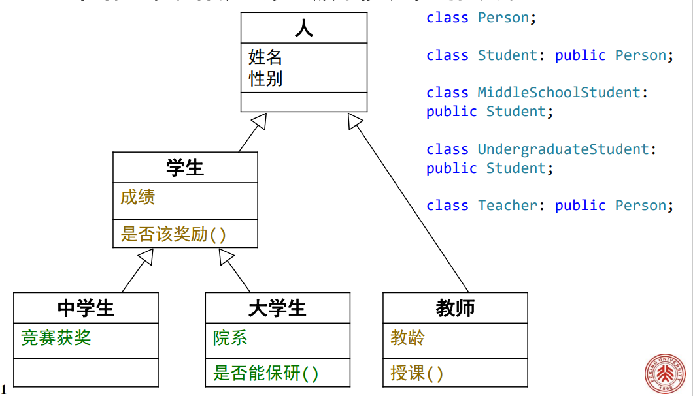

##### 关联关系

使用**类的成员变量**可以实现**关联关系**，这又分为两种情形：

成员变量使用**类类型对象**可以实现 **“部分于”关系**，UML中称为“组合”关系。

```c++
class Head;

class Body {
    Head h;     // 头是人体的一部分
};
```

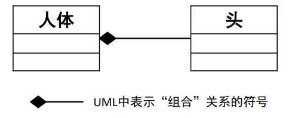

成员变量使用**类类型对象的指针**可以实现 **“有”关系**，UML中称为“聚合”关系。

```c++
class Wheel;

class Car {
    Wheel *w;     // 汽车有轮子
};
```

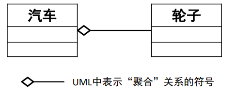

**“部分于”是比“有”更强的关系**。头部分于人体，人体没有头、头没有人体都不行；汽车有轮子，轮子没有汽车也有价值。

##### 依赖关系

使用**类类型的成员函数参数**可以实现依赖关系。

```c++
class Keyboard;

class Programmar {
    void input(Keyboard kb);    // 程序员使用键盘
};

class Bee;

class Flower {
    void pollinate(Bee b);    // 花依赖于蜜蜂传粉
};
```

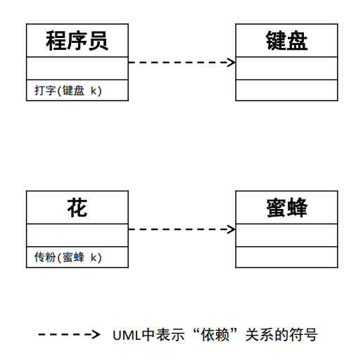


## 多态

函数重载是一种多态，类的虚函数也可以触发多态。

多态的实质：父类定义共同接口，子类不同实现。通过父类以相同的方式操作不同子类的行为。

### 多态的表现形式其一

**基类类型的指针或引用可以指向基类类型的对象，也可以指向派生类类型的对象**。

当通过**基类指针或基类引用**调用基类和派生类中的**同名虚函数**时：
若指针或引用指向**基类**对象，则调用**基类的虚函数**。
若指针或引用指向**派生类的对象**，则调用**派生类的虚函数**。

```c++
class Base {
public:
    virtual void someVirtualFunction() { cout << "base function" << endl; }
};
class Derived : public Base {
public:
    virtual void someVirtualFunction() { cout << "derived function" << endl; }
};
int main() {
    Derived oDerived;
    Base *p = &oDerived;
    p->someVirtualFunction();
}
/* 输出结果：
derived function
*/
```

### 虚函数

虚函数：类的定义中，前面有 `virtual` 关键字的成员函数。

`virtual` 关键字只需要在**类定义里的函数声明**中写，无需在类外定义时写。

**静态成员函数不能是虚函数**，**构造函数不能是虚函数**。

**任何用于覆盖虚函数的派生类同名函数也是虚函数**，无论这些派生类的同名函数是否显式被 `virtual` 限定。

派生类中若有与基类的虚函数**同名、同参数列表**的函数，则会覆盖基类的虚函数。通过指向派生类对象的基类指针或引用调用此函数，会调用派生类中的虚函数。这是隐式的覆盖，为了避免出错，最好在派生类虚函数声明中加上 `override` 关键字。同理，若不希望虚函数或类被继续覆盖或继承，可以在声明中加上 `final` 关键字。


```c++
class A {
public:
    virtual void f() {}
};
class B : public A {
public:
    void f() {}  // 尽管没有virtual关键字修饰 但它仍然是虚函数
};
class C : public B {
    void f() {}  // C::f()也是虚函数 因为B::f()是虚函数
};
```

上例中若 `virtual B::f`，但A中的f不用 `virtual` 限定，会怎么样？

则 `A::f` 不是虚函数，`B::f` 和 `C::f` 是虚函数。

**在基类的普通成员函数中调用虚函数，也会触发多态**。

```c++
class Base {
public:
    void callF() {
        f();  // 相当于 this->f(); this是基类指针
    }
    virtual void f() {  // 虚函数，可被子类覆盖
        cout << "Base called" << endl;
    }
};

class Derived : public Base {
public:
    void f() { cout << "Derived called" << endl; }
};

int main() {
    Base* b = new Derived;
    b->callF();  // 输出 Derived called
}
```

**在构造函数和析构函数中调用虚函数时，调用的是构造函数和析构函数所在类的虚函数**。因为在构造和析构时，派生类尚未形成或已经消失。

```c++
class Father {
public:
    virtual void hello() { cout << "hello from Father " << endl; };
    virtual void bye() { cout << "bye from Father " << endl; };
};

class Son : public Father {
public:
    void hello() { cout << "hello from Son " << endl; };
    Son() { hello(); };
    ~Son() { bye(); };
};

class Grandson : public Son {
public:
    void hello() { cout << "hello from Grandson " << endl; };
    Grandson() { cout << "constructing Grandson " << endl; };
    ~Grandson() { cout << "destructing Grandson " << endl; };
};

int main() {
    Grandson gson;    // 先调用Son的构造函数 后调用Grandson的构造函数 在Son的构造函数里调用Son类里的 hello() 而不是Grandson类里的hello() 
    Son *pson;
    pson = &gson;
    pson->hello();
    return 0;
}

/*输出结果
hello from Son
constructing Grandson
hello from Grandson
destructing Grandson
bye from Father
*/
```

诡异的地方：**虚函数的访问权限检查根据指针类型来判断**。

```c++
class Base {
private:
    virtual void fun2() { cout << "Base::fun2()" << endl; }
};
class Derived : public Base {
public:
    virtual void fun2() { cout << "Derived:fun2()" << endl; }
};

int main() {
    Derived d;
    Base *pBase = &d;
    pBase->fun2();  // 编译出错，fun2()是Base的私有成员
    // 如果Base中fun2是公有的 Derived中fun2是私有的 则此句编译不出错 且能冲破访问权限限制正确调用Derived::fun2()
}
```

### 虚析构函数

若一个基类类型的指针指向一个派生类对象，则 `delete` 这个基类指针时，通常**只调用基类的析构函数**，而不是先调用派生类析构函数，再调用基类析构函数。这是不安全的。因此，绝大部分情况下，**基类的析构函数都应当是虚的**。

```c++
class Son {
public:
    ~Son() { cout << "bye from Son" << endl; };
};

class Grandson : public Son {
public:
    ~Grandson() { cout << "bye from Grandson" << endl; };
};

int main() {
    Son *pSon;
    pSon = new Grandson;
    delete pSon;
}
// 如果基类的析构函数不是虚的，就只会调用 ~Son() 输出 bye from son
```

### 纯虚函数和抽象类

纯虚函数：带有纯说明符 `= 0` 的虚函数。例如 `virtual void print() = 0;`。

由于语法限制，`= 0` 和函数体不能同时出现，因此**纯虚函数不允许类内定义**。

如果纯虚函数始终不会被调用，则无需给出其定义。但**如果纯虚函数是析构函数，则必须提供其定义**。

抽象类：包含纯虚函数的类。

抽象类只能作为基类来派生新类，**不能创建抽象类的对象**。


**可以在抽象类的成员函数内调用纯虚函数**，但不能在构造函数和析构函数内调用纯虚函数。

```c++
class A {
public:
    virtual void f() = 0;    // 纯虚函数
    void g() { this->f(); }  // ok
    A() {}                   // 如果是A(){ f( ); }则错误
};

class B : public A {
public:
    void f() { cout << "B:f()" << endl; }
};

int main() {
    B b;
    b.g();
    return 0;
}
```

如果一个类从抽象类派生而来，那么**当且仅当它实现了基类中的所有纯虚函数，它才能成为非抽象类**。

抽象类经常作为一个一般性概念而存在；它会包含若干个具体的派生类作为这个一般性概念的具体解释。抽象类的纯虚函数则作为一个约束，要求其派生类必须实现这些纯虚函数的定义。

### 运行时类型识别

运行时类型识别（RunTime Type Identification, RTTI）

C++ 只允许**有虚函数的类**使用 RTTI。

`typeid` 运算符可以得到派生类对象的**运行时实际类型**：

```c++
#include <typeinfo>    // 使用 typeid 必须引入

using std::cout, std::cin, std::endl;

class B {
public:
    virtual ~B() { }
};

class D1 : public B { };

class D2 : public B { };

int main() {
    B *b = new D1;
    if (typeid(*b) == typeid(D1))    // typeid 的操作数可以是表达式，也可以是类型
        cout << "b has type D1" << endl;
    if (typeid(*b) == typeid(D2)) 
        cout << "b has type D2" << endl;
    delete b;
}
```

多态类型：拥有虚函数的类及其派生类可被称为多态类型。

多态类型的指针和引用会指向（绑定到）两种意义上的类型，一种是*声明时使用的类型*，称为**静态类型**。静态类型在编译时即可确定。另一种是*运行时实际指向的类型*，称为**动态类型**。动态类型可能在运行期间改变。

静态类型和动态类型的概念只存在于多态类型的指针和引用中。


# 泛型程序设计

泛型程序设计（Generic Programming）：编写代码时不指定具体的数据类型，而使用**抽象的类型**来编写；**实例化时再提供参数**来指明类型。

泛型程序设计可以减少重复代码，提高**可复用性**。

C++泛型程序设计：
- 使用模板设计程序
- 标准模板库（Standard Template Library）


## 函数模板

函数模板是提供生成函数能力的语法：`template <模板形参表> 函数签名 (函数体)`。

模板形参表是由逗号分隔的模板形参:
- 类型模板形参：`typename 形参名` 或 `class 形参名`
- 非类型模板形参

在函数模板的返回值类型、函数形参表、函数体中，可以使用模板形参名来指代数据类型。

```c++
template<typename T>
void print(T x) {
    cout << x << endl;
}
```

从函数模板生成函数的过程称为**函数模板的实例化**。

实例化发生在**编译时**，已经实例化的函数被再次调用时**不会被重新实例化**。

可以利用带**模板实参**的*函数模板调用表达式*来实例化函数模板，例如 `print<int>(42);`，其中 `int` 是 `print` 模板的模板实参。此时，如果 `print<int>` 尚未被实例化，那么开始一次模板实例化：首先取出模板声明，然后用模板实参列表里的实参替换声明中的模板形参，得到模板的实例化函数。

**函数模板实参推导（Function Template Argument Deduction, TAD）**：调用函数模板时省略模板实参，根据函数实参来推导模板实参的值。例如：定义了 `template<typename T> void print(T x)` 之后，调用 `print(42);`，编译器根据函数实参值 `42` 推导得模板实参 `int`。

赋值兼容原则可能引起函数模板中**类型参数的二义性**：

```c++
template<typename T>
T myFunc(T arg1, T arg2) {
    cout << arg1 << " " << arg2 << endl; 
    return arg1;
}
myFunction(5, 8.4); //error 将T替换为int还是double呢? 二义性！
```

为了避免二义性，可以在函数模板中**使用多个类型参数**：`template <typename T1, typename T2> T1 myFunc(T1 arg1, T2 arg2);`。

函数模板也可以**重载**，只要它们的**函数形参或模板形参表不同**：

```c++
template <typename T>
T myFunction(T arg) {
    cout << "one argument";
    return arg;
}

template <typename T1, typename T2>
T1 myFunction(T1 arg1, T2 arg2) {
    cout << "two arguments";
    return arg1;
}

int main() {
myFunction(5);         // ok，T替换为int
myFunction(5.8, 8.4);  // ok，T1和T2替换为double
myFunction(5, 8.4);    // ok，T1替换为int, T2替换为double
}
```

函数和模板的匹配顺序：
1. 先寻找一个参数**完全匹配**的**普通函数**
2. 找不到，则寻找一个参数**完全匹配**的由函数模板实例化出来的函数
3. 找不到，则在**无二义性前提下**寻找一个参数经自动类型转换后能够匹配的普通函数
4. 找不到，报错


## 类模板

类模板是能够生成类的语法。

```c++
template <typename T1, typename T2>
class Pair {
public:
    T1 key;    // 关键字
    T2 value;  // 值
    Pair(T1 k, T2 v) : key(k), value(v){};
    bool operator<(const Pair<T1, T2> &p) const;
};

// 类外定义成员函数
template <typename T1, typename T2>
bool Pair<T1, T2>::operator<(const Pair<T1, T2> &p) const {
    return key < p.key;
}

int main() {
    Pair<string, int> student("Tom", 19);  // 实例化出一个类Pair<string, int>
    cout << student.key << " " << student.value;
}
```

**类模板实参推导（Class Template Argument Deduction，CTAD）**：可省略模板实参，利用构造函数实参推导，如 `Pair(3.14, 19);`。


函数模板可以作为类的成员。该成员函数**只有在被调用时**才会被实例化。

为**类模板**中各类型参数指定了具体的数据类型后，即得到一个**模板类**。

如果模板实参不同，则得到的模板类是不同的，即**同一个类模板的两个模板类是不兼容的**。

```c++
Pair<string, int> *p;
Pair<string, double> a = &p;    // error!
```

### 类模板与派生

类模板从类模板派生：

```c++
template <typename T1, typename T2>
class A {
    T1 v1;
    T2 v2;
};

template <typename T1, typename T2>
class B : public A<T2, T1> {
    T1 v3;
    T2 v4;
};

template <typename T>
class C : public B<T, T> {
    T v5;
};

B<int, double> obj1;    // class B<int, double> : public A<double, int>
```

类模板从模板类派生：

```c++
template <typename T1, typename T2>
class A {
    T1 v1;
    T2 v2;
};

template <typename T>
class B : public A<int, double> {
    T v;
};

int main() {
    B<char> obj1;  // 自动生成两个模板类: A<int, double> 和 B<char>
}
```

普通类从模板类派生：

```c++
template <typename T>
class A {
    T v1;
    int n;
};

class B : public A<int> {
    double v;
};

int main() {
    B obj1;
}
```

## 非类型模板参数

模板参数并不一定是类型，还可以是变量。作为变量的模板参数称为非类型模板参数。

```c++
template <int N>
int multiply(int m) {
    return N * m;
}

int main() {
    multiply<4>(3); 
}
```

```c++
template <typename T, int N>
class Array {
private:
    T data[N]{};

public:
    void fill(const T& value) {
        for (int i = 0; i < N; i++) {
            data[i] = value;
        }
    }
};

int main() {
    Array<int, 5> a;
    a.fill(42);
}
```

由于模板的实例化是在编译期间完成的，所以模板实参必须是**常量**：字面量或 `constexpr`。

非类型模板参数和函数参数的区别：

```c++
// 非类型模板参数
template<int N, int M> 
int add() {
    return N + M;
}

// 普通函数参数
int add(int n, int m) {
    return n + m;
}
```

模板 `add` 是有能力生成大量函数的语法，**从编译器角度，`add<1, 2>` 和 `add<3, 4>` 是两个不一样的函数**，而 `add(1, 2)` 和 `add(3, 4)` 是同一个函数的调用。

**非类型模板参数可以提高程序的执行效率**，因为求值的过程被提前到了编译时期。

## 可变参数模板

可变参数模板（variadic template）：接受可变数目参数（称为参数包，parameter packet）的模板函数或模板类。

```c++
template <typename T, typename... Args>
void foo(const T& t, const Args& ... rest);
```

上例中，`foo` 是一个**可变参数函数模板**，拥有一个名为 `T` 的类型参数，和一个名为 `Args` 的**模板参数包**（表示 0 个或多个额外的类型参数）。`foo` 的函数参数列表包含一个 `const T&` 类型的参数和一个名为 `rest` 的**函数参数包**（表示 0 个或多个额外的函数参数）。

```c++
foo(42, "hi", 3.14);    // 实例化出 void foo(const int&, const char[3]&, const double&);
foo(0);    // 实例化出 void foo(const int&);
```

`sizeof...()` 返回参数包中的参数数目，和 `sizeof()` 一样，它不会对其实参求值。

```c++
template <typename... Args>
void g(Args ... args) {
    cout << sizeof...(Args) << endl << sizeof...(args) << endl;
}
```

我们也可以用 `std::initializer_list` 定义一个可接受可变数目实参的函数，但这种方法定义的变参**类型必须相同**（或可转换为相同类型）。

```c++
void func(std::initializer_list<int> list) {
    for (auto& item : list)
        cout << item << endl;
}

int main() {
    func({1, 2, 3, 4 ,5});
}
```

为了在既不知道实参数目也不想管实参类型的时候方便地定义函数，我们可以**递归地**定义可变参数函数模板：

> 对于一个参数包，我们除了能用 `sizeof...` 获取其大小之外，唯一能做的事就是**扩展（expand）** 它，即包展开。包展开最简单的做法，就是在后面加上 `...`，这样 `args...` 就会被替换为**逗号分隔的每一个形参的具体值**的形式。任何期望“**逗号分隔的值的列表**”的地方都可以出现形参包的展开，比如函数调用表达式的实参列表。

```c++
void print() { cout << endl; }

template <typename T, typename... Args>
void print(const T& x, const Args&... rest) {    // Args 的包展开
    cout << x << endl;
    if (sizeof...(rest) != 0) print(rest...);    // rest 的包展开
}

int main() {
    print(1, 3.14, "a string", 0);
    print();
    print("aaa");
}
```

更通用的包展开形式是**展开模式**，所谓模式，就是**包含形参包的表达式**。例如：

```c++
template <typename.. Args>
std::vector<double> makeSqrtVec(Args... args) {
    return {std::sqrt(args)...}
}
```

折叠表达式允许在参数包或非类型模板形参包（如 `template<int... Ns>`）中**连续地做二元运算**，可分为左折叠和右折叠。

左折叠形如 `(... op args)`，将 `1, 2, 3, 4` 作用于其上则得到 `(((1 + 2) + 3) + 4)`
右折叠形如 `(args op ...)`，将 `1, 2, 3, 4` 作用于其上则得到 `(1 + (2 + (3 + 4)))`
（外围的括号必需）

以上的形式要求形参包形参个数大于等于 `2`，对个数更少的形参包，可以指定初始值：`(init op ... op args)` 或 `(args op ... op init)`。

```c++
template<typename... Args> 
auto sum(Args... args) {
    return (... + args);
}

template <int... args>
class Sum {
public:
    static const auto value{(... + args)};
};

template <typename... Args>
auto sumOfSquare(Args... args) {
    return (... + (args * args));
}


// 用带初始值的形式重写 print
template <typename... Args>
void print(Args... args) {
    ((std::cout << args), ..., (std::cout << '\n'));
}
```

### 待决名的消歧义符

#### `typename` 消歧义符

```c++
template<typename T>
void foo(const std::vector<T> &v) {
    std::vector<T>::const_iterator* p;  
    // std::vector<T>::const_iterator 是待决名
    // 编译器默认认为待决名是一个静态成员变量
    // 这条语句被认为是一个乘法表达式
}
```

解决办法：

```c++
typename std::vector<T>::const_iterator* p;   //声明前显式加上 typename

typedef typename std::vector<T>::const_iterator iter_t;
iter_t* p2;    // 声明类型别名 注意类型别名的声明前也要加上 typename
```

#### `template` 消歧义符

```c++
template<typename T>
struct S {
    template<typename U>
    void foo() {}
};
 
template<typename T>
void bar() {
    S<T> s;
    s.foo<T>();          // 错误：< 被解析为小于运算符
}
```

解决办法：

```c++
s.template foo<T>();
```

## 标准模板库

库：伴随编译器提供给程序员的一系列已编译好或尚未编译的代码，标准库头文件中对这些代码进行了声明。

STL 的设计理念：

| 程序的需求 | STL的抽象 |                                           特点                                            |
| :--------: | :-------: | :---------------------------------------------------------------------------------------: |
|  存储数据  |   容器    |                      是**类模板**，容纳各种数据类型的通用数据结构。                       |
|  读写数据  |  迭代器   | 类似于**指针**，可用于依次存取容器中的元素。至少具备 `++` 和 `*` 操作，指针也是一种迭代器 |
|  操作数据  |   算法    |           是**函数模板**，操作容器中的元素。算法本身与其操作的数据的类型无关。            |

### 容器

容器：可以用于存放各种类型的数据（基本类型的变量，对象等）的数据结构，都是类模板。

容器分为三种：
- 顺序容器：`vector` `deque` `list`
- 关联容器
    - 有序关联容器：`set` `multiset` `map` `multimap`
    - 无序关联容器：`unordered_set` `unordered_map` `unordered_multiset` `unordered_multimap`
- 容器适配器：`stack` `queue` `priority_queue`

对象被插入容器中时，被插入的对象实际上是此对象的**拷贝**。

#### 容器的成员函数

大部分标准库容器共有的成员函数，这些函数主要与容器本身结构有关。

##### 构造函数
`C c`：默认构造函数，构造空容器。

`C c1(c2)`：复制构造函数，构造 `c2` 的拷贝

`C c(b, e)`：`b` `e` 为迭代器，从它们确定的范围复制构造，从而可以用 `vector` 构造 `deque`（`array` 不支持）

`C c{a, b, ...}`：列表初始化

##### 赋值

`c1 = c2`：普通的复制赋值，**容器类型必须相同**

`c = {a, b, ...}`：初始化列表赋值（`array` 不适用）

`swap(c1, c2)` `c1.swap(c2)`：**通常比复制赋值快得多**，提倡使用前者

`assign`（不适用于关联容器和 `array`）
    - `seq.assign(b, e)`：`b` `e` 为迭代器，不能指向 `seq` 中元素，**允许从不同但相容的类型赋值**
    - `seq.assign(il)`：`il` 为初始化列表
    - `seq.assign(n, t)`：`n` 个值为 `t` 的元素


赋值会使**指向左边容器内部的迭代器、引用和指针失效**，但 `swap` 不会，`swap` 不对任何元素进行复制、删除或插入，因而能在常数时间完成交换（`string` `array` 除外）。当然，`swap` 之后原来左边容器内部的迭代器、引用、指针会变成原来右边容器内部的迭代器、引用、指针。

`assign` 可以从其他容器赋值：

```c++
list<string> names;
vector<const char*> old;
names = old;    // error!
names.assign(old.cbegin(), old.cend());  // ok
```

##### 其他成员函数

- `c.begin()` `c.end()`：分别返回指向容器**首元素**和**尾后元素**的迭代器
- `c.cbegin()` `c.cend()`：分别返回指向容器**首元素**和**尾后元素**的 **`const`** 迭代器
- `c.rbegin()` `c.rend()`：分别返回指向容器**尾元素**和**首前元素**的**反向**迭代器（不支持 `forward_list`）
- `c.crbegin()` `c.crend()`：分别返回指向容器**尾元素**和**首前元素**的**反向 `const`** 迭代器（不支持 `forward_list`）

- 比较运算符：`<=` `>=` `<` `>` `==` `!=`
    - `==`：大小相同且所有元素对应相等
    - `<`：*大小不同，左边容器更小，且等于右边大容器的某个前缀子序列* 或 *两容器不互为前缀子序列时，左边容器的第一个与右边容器对应不等的元素小于右边容器的对应元素*
- `c.empty()`：判断是否为空
- `c.max_size()`：返回容器容量
- `c.size()`：返回元素个数
- `c.swap(container)`：交换两个容器的内容


#### 顺序容器

顺序容器：容器内的元素**并非排序的**，元素的插入位置与元素的值无关，**元素的顺序可以被控制**。

- `vector`：动态数组。元素**在内存中连续存放**，**随机存取**任何元素都能在常数时间完成，**尾端增删元素**性能较佳（一般为常数时间）。
- `deque`：**双向队列**、也是动态数组。元素**在内存连续存放**。**随机存取**任何元素都能在常数时间完成（但**次于 `vector`**）。在**两端增删元素**具有较佳的性能（一般为常数时间）
- `list`：**双向链表**。元素**在内存不连续存放**。**不支持**随机存取。在**任何位置增删元素**都能在常数时间完成。

> 随机存取可理解为通过下标快速访问


##### 顺序容器的常用操作

`C seq(n)` `C seq(n, t)`：构造函数。包含 `n` 个被值初始化为 `t` 的元素，`t` 默认为 `0`。

`c.resize(n)` `c.resize(n, t)`：改变容器大小，多出来的元素会（从 `t`）值初始化添加到容器末尾

###### 访问元素

`c.front()` `c.back()`：分别返回**首元素**和**尾元素**的**引用**。

`c[n]`：下标访问，返回引用

`c.at(n)`：下标访问，若越界抛出 `out_of_range` 异常

###### 添加元素

`c.push_back(t)` `c.pop_back(t)`：在容器末尾增加或删除值为 `t` 的元素，返回 `void`

`c.emplace_back(args)` `c.emplace_front(args)`：在容器末尾增加或删除由 `args` 创建的元素，返回 `void`

`c.insert(p, t)` `c.insert(p, args)`：在迭代器 `p` 指向的元素**之前**创建一个值为 `t` 或由 `args` 创建的元素，返回**指向新添加的元素的迭代器**

`c.insert(p, n, t)`：在迭代器 `p` 指向的元素**之前**插入 `n` 个值为 `t` 的元素，返回**指向新添加的第一个元素的迭代器**（`n` 为 `0` 则返回 `p`）

`c.insert(p, b, e)`：在迭代器 `p` 指向的元素**之前**插入迭代器 `b` 和 `e` 确定的范围内的元素，返回**指向新添加的第一个元素的迭代器**（范围为空则返回 `p`），`b` `e` **不能是目标容器 `c` 的迭代器**

`c.insert(p, il)`：在迭代器 `p` 指向的元素**之前**插入初始化列表 `il` 里的元素，返回**指向新添加的第一个元素的迭代器**（列表为空则返回 `p`）


> `array` 不支持插入操作，向 `vector` `string` `deque` 插入元素会使**插入点之后的所有迭代器、引用、指针失效**，使**插入点之前的所有迭代器、引用、指针可能失效**。
> 
> `insert` 返回**指向新添加的第一个元素的迭代器**，这可以帮助编程时更新迭代器，防止失效错误（`it = vec.insert(it, 42);`）。
> 
> `insert` 之所以在 `p` 之前插入，是因为这样既可以支持**头部插入**，又可以**避免在尾后插入**。
> 
> `emplace` 和 `push` 的区别在于前者**构造**，而后者**复制**。

###### 删除元素

`c.pop_back()` `c.pop_front()`：返回 `void`

`c.erase(p)`：删除迭代器 `p` 指向的元素，返回指向**被删除元素之后元素的迭代器**（若 `p` 指向尾元素，返回尾后迭代器）

`c.erase(b, e)`：删除迭代器 `b` `e` 确定的范围内的元素，返回指向**最后一个被删除元素之后的迭代器**或尾后迭代器。

`c.clear()`：清空

> `array` 不支持，`forward_list` 不适用。
> 
> 删除 `deque` 除首尾外任何元素都会使**所有迭代器、引用、指针失效**。`vector` `string` 在**删除点之后所有位置的迭代器、引用、指针失效**。
> 
> `erase` 返回**最后一个被删除元素之后的迭代器**，这可以帮助编程时更新迭代器，防止失效错误（`it = vec.erase(it);`）。
>
> 不要在范围 `for` 循环中增删元素，因为其中用到的迭代器是在循环之前得到的。

###### 特殊的成员函数

`std::deque` 和 `std::list` 还支持 `c.push_front(t)` `c.pop_front(t)` 操作。

`std::list` 和 `std::forward_list` 定义了几个成员函数形式的容器算法：

`lst.sort()` `lst.sort(comp)`：排序。`std::list` 没有随机访问迭代器，因此不支持 STL 的 `std::sort` 算法

`lst.unique()` `lst.unique(pred)`：调用 `lst.erase` 删除连续重复元素。重复与否调用 `==` 或 `pred` 判定。

`lst.merge(lst2)` `lst.merge(lst2, comp)`：将来自 `lst2` 的元素合并进 `lst`。`lst` 和 `lst2` 必须是有序的，元素将从 `lst2` 删除，因此合并后 `list2` 为空。

`lst.remove(val)` `lst.remove_if(pred)`：调用 `lst.erase` 删除与 `val` 相等（调用 `==`）或使 `pred` 为 `true` 的**所有**元素

`lst.reverse()`：反转链表

链表类型还定义了 `splice` 算法：

`lst.splice(args)` 或 `flist.splice_after(args)`

`(p, lst2)`：`p` 是指向 `lst` 中元素（或指向 `flst` 首前位置）的迭代器。函数将 `lst2` 所有元素移动到 `lst` 中 `p` 之前的位置（或 `flst` 中 `p` 之后的位置）。`lst2` 中的相应元素会被删除。**`lst` 和 `lst2` 是不同的链表**。

`(p, lst2, p2)`：`p2` 是指向 `lst2` 中位置的迭代器。函数将 `p2` 指向的元素移动到 `lst` 中（或将它之后的元素移动到 `flst` 中）。**`lst`（`flst`）和 `lst2` 可以是相同的链表**。

`(p, lst2, b, e)`：`b` `e` 是 `lst2` 中的范围。函数将这一范围确定的元素移动到 `lst` 中（或 `flst` 中）。**`lst`（`flst`）和 `lst2` 可以是相同的链表**，但 `p` 不能在范围 `b` `e` 之内。


  


#### 关联容器

有序关联容器：元素是有序排列的，从而**插入和检索只需要 $O(\log n)$ 的时间**。

- `set`：集合。不允许重复元素。
- `multiset`：允许重复元素的集合。
- `map`：映射。存放成对的 `key` 和 `value`，根据 `key` 对元素排序，可快速地**根据 `key` 检索元素**。
- `multiset`：允许重复 `key` 的映射。

有序关联容器上，**关键字类型必须定义元素比较的方法**（默认为 `operator<`）。


无序关联容器：元素按照特定顺序（乱序）存放，**插入和检索只需要 $O(1)$ 的时间**。

- `unordered_set`
- `unordered_map`
- `unordered_multiset`
- `unordered_multimap`

无序容器使用*哈希函数*和关键字类型的 `==` 运算符组织元素。无序容器性能一般更好。


##### `std::pair`


`std::pair` 类模板保存一对数据，它有以下成员：

`pair<T1, T2> p`：默认构造函数，对 `T1` `T2` 类型的两个成员执行值初始化

`pair<T1, T2> p(v1, v2)` `pair<T1, T2> p{v1, v2}`：构造函数，用 `v1` `v2` 初始化

`make_pair(v1, v2)`：返回一个用 `v1` `v2` 初始化的 `std::pair`，后者的类型从 `v1` `v2` 推断

`p.first` `p.second`：返回 `p` 的数据成员（它们是 `public` 的）

`p1 relop p2`：关系运算符，按字典序定义。

`p1 == p2` `p1 != p2`：判断相等性，调用 `==`


`std::pair` 的实现：

```c++
template <class _T1, class _T2>
struct pair {
    typedef _T1 first_type;
    typedef _T2 second_type;
    _T1 first;
    _T2 second;
    pair() : first(), second() {}
    pair(const _T1& __a, const _T2& __b) : first(__a), second(__b) {}
    template <class _U1, class _U2>
    pair(const pair<_U1, _U2>& __p) : first(__p.first), second(__p.second) {}
};
```


##### 关联容器的常用操作

关联容器定义了额外的类型别名：

- `key_type`：关键字类型
- `mapped_type`：只适用于 `map`，关键字关联的类型
- `value_type`：对于 `set`，与 `key_type` 等价；对于 `map`，是 `pair<const key_type, mapped_type>`

###### 关联容器迭代器

关联容器迭代器的解引用运算符**返回一个 `value_type` 类型的值**。
`set` 虽然既有 `iterator` 又有 `const_iterator`，但它的这两种迭代器实际上都是 `const` 的。

```c++
std::map<std::string, size_t> word_count{{"hi", 10}, {"hello", 20}};
auto it = word_count.begin();

std::cout << it->first;    // 打印关键字
it->first = 100;    // error! 关键字是 const 的
it->second = 42;    // ok 

std::set<int> nums{0, 1, 2, 3};
std::set<int>::iterator iter = nums.begin();
*iter = 42;    // error! 
```

###### 添加、删除元素

添加元素：

`c.insert(v)` `c.emplace(args)`：`v` 是 `value_type` 类型的对象（可以由 `args` 构造一个 `value_type` 类型的对象）

`c.insert(b, e)`：`b` `e` 表示 `value_type` 类型对象的范围

`c.insert(il)`：`il` 是 `value_type` 类型对象的花括号列表

对于 `map` 和 `set`，只有当元素关键字不在关联容器里时插入才会被执行。插入函数返回一个 `pair`，包含一个指向**指定关键字对应的元素**的迭代器和一个指示插入是否成功的 `bool`。也就是说，若关键字已经存在，则插入函数什么也不做，并返回一个将此元素的迭代器和一个 `false` 绑定的 `pair`。

对于 `multimap` 和 `multiset`，插入总会被执行。插入函数返回一个指向新元素的迭代器。

删除元素：

`c.erase(k)`：删除**所有关键字为 `k` 的元素**，返回**删除的元素个数**

`c.erase(p)` `c.erase(b, e)`：删除迭代器 `p`（或范围 `b` `e`）指定的元素，返回 `p` 之后的元素的迭代器（或 `e`）

###### 访问元素

`map` 和 `unordered_map` 提供了下标运算符和 `at` 成员函数。`set`、`multimap`、`multi_unordered_map` 不支持它们。

```c++
map<std::string, size_t> word_count;
word_count["hi"] = 42;    // 若关键字 "hi" 不在关联容器内 则插入一个 {"hi", (值初始化)} 的键值对 再提取出新插入的元素 赋值为 42
word_count.at("hi");    // 访问关键字为 "hi" 的元素 若未找到则抛出异常
```

在关联容器中查找元素：

`c.find(k)`：返回一个迭代器，指向**第一个关键字为 `k` 的元素**，未找到则返回尾后迭代器

`c.count(k)`：返回**关键字为 `k` 的元素的个数**

`c.lower_bound(k)`：只适用于有序容器。返回一个迭代器，指向**第一个关键字不小于 `k` 的元素**

`c.upper_bound(k)`：只适用于有序容器。返回一个迭代器，指向**第一个关键字大于 `k` 的元素**

`c.equal_range(k)`：返回一个迭代器 `pair`，指示**关键字等于 `k` 的元素的范围**。若不存在，则返回两个尾后迭代器 `pair`。相当于同时返回了 `lower_bound` 和 `upper_bound`。

要遍历 `multi-` 关联容器中同一关键字对应的元素，可以用 `find` 和 `cound`，也可以用 `lower_bound` 和 `upper_bound`，还可以只用 `equal_range`。


`std::multiset`

```c++
template<class Key, class Pred = less<Key>, class A = allocator<Key>>
class multiset {
    // ...
};
```

`Key` 表示容器中每个元素的类型，`Pred` 类型的变量定义了 `multiset` 中的元素之间的“小于号”（缺省类型是 `less<Key>`，即 `<`）。


`std::multimap`

```c++
template<class Key, class T, class Pred = less<Key>, class A = allocator<T>>
class multimap {
    // ...
    typedef pair<const Key, T> value_type;
    // ...
};
```


#### 容器适配器

容器适配器：通过封装某个序列式容器，并重新组合该容器中包含的成员函数，使其满足某些特定场景的需要。

- `stack`：**栈**。缺省基于 `deque`，是项的有限序列，增删和检索满足 last-in-first-out。
- `queue`：**队列**。缺省基于 `deque`，只能**尾部插入、头部删除、头尾检索和修改**。满足 first-in-first-out。
- `priority_queue`：**优先队列**。缺省基于 `vector`，最高优先级元素总是第一个出列。

容器适配器本质上还是容器，只不过此容器模板类的实现，利用了大量其它基础容器模板类中已经写好的成员函数。

##### 栈

`stack` 缺省用 `deque` 实现，也可以用其他能添加、删除元素，访问尾元素的容器实现。用 `vector` 和 `deque` 实现的 `stack` 要比用 `list` 实现的性能好。 

```c++
deque<int> deq{1, 2, 3};
stack<int> stk(deq);    // 从 deq 复制

stack<int, vector<int>> vec_stk;   // 基于 vector 定义的 stack
```

`stack` 支持 `s.pop()` `s.push(item)` `s.emplace(args)` `s.top()` 等操作。


##### 队列

`queue` 支持 `q.pop()` `q.front()` `q.back()` `q.push(item)` `q.emplace(args)`。不支持 `q.top()`。

`queue` 可以用 `list` `vector` 和 `deque` 实现，缺省情况下用 `deque` 实现。

`priority_queue` 支持 `q.pop()` `q.front()` `q.top()` `q.push(item)` `q.emplace(args)`。不支持 `q.back()`。

`priority_queue` 可以用 `vector` `deque` 实现，缺省情况下用 `vector` 实现。通常用**堆排序技术**实现，保证最大的元素总是在最前面。


### 迭代器

迭代器是 STL 提供的类似指针的数据结构。只要 `*it` 和 `++it` 是合法的，`it` 就是迭代器。迭代器用于指向顺序容器和关联容器中的元素，有 `const` 和非 `const` 两种。

```c++
vector<int> vec;

vector<int>::const_iterator i;    // const 迭代器
for (i = v.begin(); i != v.end(); ++i)
    cout << *i << endl;

vector<int>::iterator j;    // 非 const 迭代器
for (j = v.begin(); j != v.end(); ++j)
    *j = 100;
```

容器操作可能使迭代器、指针、引用失效。利用 `insert()` `erase()` 返回的迭代器编写循环可以避免失效错误。`c.end()` 迭代器总是会失效，不要保存它，反复调用它。

#### 迭代器的种类

迭代器按功能由弱到强可以分为 6 种：

1. 输入迭代器（Input Iterator）：只读访问数据
2. 输出迭代器（Output Iterator）：只写访问数据
3. 前向迭代器（Forward Iterator）：读写数据、且能一次一个地向前推进迭代器
4. 双向迭代器（Bidirectional Iterator）：读写数据、且能一次一个地向前、向后推进迭代器
5. 随机访问迭代器（Random Access Iterator）：读写数据、且能在数据中随机移动
6. 连续迭代器（Contiguous Iterator）：读写数据、且能在数据中随机移动，相邻容器元素在内存中物理相邻

编号小的迭代器的功能是编号大的迭代器的子集。

不同迭代器所能进行的操作：

- 所有迭代器：`++it` `it++`
- 输入迭代器：`*it` 读取
- 输出迭代器：`*it` 修改
- 前向迭代器：以上全部，`it0 == it1` `it1 != it0`
- 双向迭代器：以上全部，`--it` `it--`
- 随机访问迭代器：以上全部，以及
    - `it += i` `it + i`
    - `it0 < it1`
    - `it[i]`：`it` 后第 `i` 个元素的引用
- 连续迭代器：以上全部，`it1 - it0` 恰好是其所指向元素的地址的差

不同容器所支持的迭代器种类：

|             容器             | 容器上的迭代器种类 |
| :--------------------------: | :----------------: |
|             数组             |     连续迭代器     |
|        `std::vector`         |     连续迭代器     |
|         `std::deque`         |   随机访问迭代器   |
|         `std::list`          |     双向迭代器     |
| `std::set` / `std::multiset` |     双向迭代器     |
| `std::map` / `std::multimap` |     双向迭代器     |
|     `std::forward_list`      |     前向迭代器     |
|         `std::stack`         |       不支持       |
|         `std::queue`         |       不支持       |
|    `std::priority_queue`     |       不支持       |


注意：遍历容器时总是使用 `it != v.end()` 作为结束标志，而不是 `it < v.end()`。因为**只有随机访问迭代器及连续迭代器支持 `<` 运算符**。


#### 输入输出迭代器

标准库定义了用于 IO 类型对象的迭代器。

类模板 `std::ostream_iterator` 描述一个输出迭代器对象，通过 `<<` 运算符将连续的元素写入输出流，支持解引用 `*` `->` 和自增 `++`。

类模板 `std::istream_iterator` 描述一个输入迭代器对象。通过 `>>` 运算符从输入流读入连续的元素。除了支持解引用 `*` `->` 和自增 `++` 外，还支持比较 `==` `!=`。

##### `std::istream_iterator`

使用示例：此代码从 `std::cin` 读取 `int`，在输入结束（EOF 或 IO 错误）后打印输入的值。

```c++
#include <iterator>    // std::ostream_iterator 定义于此

std::istream_iterator<int> int_it(cin);  // 将 cin 绑定到 int_it
std::istream_iterator<int> int_eof;  // 默认初始化 创建一个尾后迭代器

std::vector<int> vec;

while (int_it != int_eof) {
    vec.push_back(*int_it++);    // 解引用运算符返回从流中读取的值 自增运算符递增迭代器
}
```

上述程序可以重写为更简洁的形式：

```c++
std::istream_iterator<int> int_it, int_eof;
std::vector<int> vec(int_it, int_eof);
```

`std::istream_iterator` 允许**懒惰求值**。标准库实现一般不会在将 `istream_iterator` 绑定到某个流上时立即从流读取数据，而是把从流中读取数据的过程推迟到在第一次解引用迭代器之前，避免迭代器未使用就被销毁，便于多点同时读取。

##### `std::ostream_iterator`

可以对任何定义了 `<<` 运算符的类型定义 `std::ostream_iterator`。`std::ostream_iterator` 的构造函数可提供第二参数，它是一个在输出每个元素后打印的字符串（必须是 C 风格字符串）。`std::ostream_iterator` 不能默认初始化。

```c++
vector v{1, 2, 3, 4, 5};
ostream_iterator<int> outputInt(cout, "*");
outputInt = 10;    // 输出 10
++outputInt;
*outputInt;
outputInt++;    // 这些运算符不会做任何事情 直接返回 outputInt 可以使用它们 以使其使用风格与其他迭代器一致
copy(a.begin(), a.end(), outputInt);  // 输出 12345
```


对 `std::ostream_iterator` 的简易实现：

```c++
template <typename T>
class OstreamIterator {
public:
    // C++17 规定的迭代器必须定义的类型别名
    // C++20 只需 value_type 和 difference_type
    using value_type = T;
    using reference = T&;
    using pointer = T*;
    using difference_type = std::ptrdiff_t;
    using iterator_category = std::output_iterator_tag;
    OstreamIterator(const OstreamIterator&) = default;
    OstreamIterator& operator=(const OstreamIterator&) = default;

private:
   std::ostream* os;    // 如果设置为引用类型 那么预置复制赋值重载会被删除
   
public:
    OstreamIterator(std::ostream& os) : os{&os} {}
    OstreamIterator& operator=(const T& val) {
        *os << val;
        return *this;
    }
    OstreamIterator& operator*() {
        return *this;
    }
    OstreamIterator& operator++() {
        return *this;
    }
    OstreamIterator& operator++(int) {
        return *this;
    }
};
```

`std::ostream` 删除了复制构造函数，因此迭代器的数据成员只能为其指针或引用。

##### 实现 MyCin

```c++

class MyCin {
private:
    std::istream_iterator<int> in;
    constexpr static const std::istream_iterator<int> fail{};

public:
    MyCin() : in{std::cin} {}

    MyCin& operator>>(int& n) {
        int temp = *in++;

        if (/* 触发输入失败的条件 */)
            in = fail;
        else
            n = temp;
        return *this;
    }

    explicit operator bool() {    // 定义向 bool 的显式类型转换
        if (in == fail) return false;
        return true;
    }
};
```

定义向 `bool` 的转换，是为了实现 `while(my_cin >> n)`。之所以必须定义为显式转换，是为了让 `my_cin << n` 编译报错。也可以用 `=delete` 实现，或不定义 `bool` 转换，转而定义到 `void*` 的转换和 `!` 的重载。


#### `std::iterator_traits`

`std::iterator_traits` 是类型特征类，提供面对老式迭代器 (LegacyIterator) 类型的统一接口。这使得可以仅通过迭代器实现算法。

`std::iterator_traits` 提供五个类型：`difference_type` `value_type` `pointer` `reference` `iterator_category`。

可以用 `std::iterator_traits<It>::value_type` 获取迭代器指向的元素的类型。

在类模板中，如果声明变量时的类型名包含模板形参，则会引发歧义（类型名？还是成员变量？）并导致编译错误（编译器会默认按照成员变量处理）。可以用 `typename` 消歧义符规避。

```c++

template <typename It>
auto accumulate(It b, It e) -> typename std::iterator_traits<It>::value_type  {
    typename std::iterator_traits<It>::value_type init{};
    while (b != e) 
        init = init + *b++;
    return init;
}
```


### 算法

STL 提供在各种容器中通用的算法，如插入 / 删除 / 查找 / 排序。算法是**函数模板**，通过**迭代器**操作元素，永远不会执行容器的操作。

STL 算法大致可以分为七类：

- 不变序列算法
- 变值算法
- 删除算法
- 变序算法
- 排序算法
- 有序区间算法
- 数值算法

大多重载的算法都有**两个版本**：
- 其中一个用 `==` 或 `<` 来比较元素
- 另一个版本多出一个可调用对象参数 `Pred op`，通过 `op(x, y)` 替代 `==` 或 `<`


#### `std::find`


```c++
template<typename InIt, typename T> 
InIt find(InIt first, InIt last, const T& val);
```

`first` 和 `last` 两个迭代器给出的**左闭右开**区间确定了查找的起点和终点，函数在此区间内查找 `val`，返回**被找到的第一个元素的迭代器**（若找到）或 **`last`**（若找不到）。

```c++
vector<int> vec{1, 2, 3};

auto it0 = find(vec.cbegin(), vec.cend(), 2);  // 返回指向 vec[1] 的迭代器
auto it1 = find(vec.cbegin(), vec.cend(), 42);  // 返回 vec.cend()
```


#### `std::sort`

```c++
template<typename RanIt, typename Pred> 
void sort(RanIt first, RanIt last, Pred pr);
```

第三个参数 `pr` 是一个可调用对象，`std::sort` 用它来判断元素的大小关系。`pr(x, y)` 返回 `true` 表示 `x` 应排在 `y` 前。


```c++
int main() {
    vector a{4, 1, 6, 2};
    sort(a.begin(), a.end(), greater<int>());  // 这里的小括号表示调用 great<int> 类的默认构造函数进行初始化
    for (auto i : a) {
        cout << i << " ";
    }
}
```

`greater` 是一个**重载了 `()` 的类模板**：

```c++
template<class T> 
struct greater {
    bool operator()(const T& x, const T& y) const {
        return x > y;
    }
};
```

> 也可以用其他可调用对象作为第三个实参。
> 
> 可调用对象包括函数、函数指针、可以转换到函数指针的对象、重载了 `operator()` 的对象（又称函数对象）、Lambda 表达式）。

#### `std::copy`

```c++
template<typename InIt, typename OutIt> 
OutIt copy(InIt first, InIt last, OutIt x);
```

实现原理：对区间 `[0, last - first]` 中的每个 `N` 执行一次 `*(x + N) = *(first + N)`，返回 `x + N`。

```c++
template<typename InIt, typename OutIt>
OutIt copy(InIt _F, InIt _L, OutIt _X) {
    for (; _F != _L; ++_X, ++_F) 
        *_X = *_F;
    return _X;
}
```

使用 `std::copy` 前需要保证目标位置有足够的容量。

```c++
int main() {
    std::vector a{0, 1, 2, 3, 4};
    std::vector<int> b(5);
    std::copy(a.begin(), a.end(), b.begin());

    std::copy(a.begin(), a,end(), std::back_inserter(b));    // 向 b 的尾部插入元素
}
```


`std::copy_if` 在复制前会检查当前被复制的元素是否满足某条件，只有满足时才会复制。

```c++
#include <algorithm>
#include <iterator>

using namespace std;

int main() {
    std::vector<int> a{4, 1, 6, 2, 9, 5};
    std::vector<int> b;
    copy_if(a.begin(), a.end(), back_inserter(b), [](int x) {
        return x < 5;
    });
}
```


#### 其他算法

> `back_inserter` 定义在头文件 `iterator`，接受一个指向容器的引用，返回与该容器绑定的插入迭代器。

`accumulate(b, e, init)` ：定义在头文件 `numeric`，将 `b` `e` 范围内元素求和，求和初值为 `init`（默认为 `0`）。求和调用 `+`，故如果对 `vector<string>` 调用则会返回所有字符串首尾连接所得字符串（注意区分 `string("")` 和 `""`！）。

`fill_n(dest, n, val)`：向迭代器 `dest` 写入 `n` 个值为 `val` 的元素。常用的方法是利用 `back_inserter`：`fill_n(back_inserter(vec), 10, 0);`。

`replace(b, e, val0, val1)`：将 `b` `e` 围成的范围内所有与 `val0` 相等的值替换为 `val1`

`replace_copy(b, e, dest, val0, val1)`：不改变原序列，将结果保存至 `dest`。

`unique(b, e)`：将序列中**相邻重复项**“消除”，即使不重复项出现在序列开始，并返回指向最后一个不重复元素之后位置的迭代器。例：先 `sort(vec.begin(), vec.end())` 再 `vec.erase(unique(vec.begin(), vec.end()), vec.end())`

`transform(b, e, dest, pr)`：以 `b` `e` 围成的范围内的每一个元素调用可调用对象 `pr`，将返回值存放在 `dest`。


# C++ 多文件工程

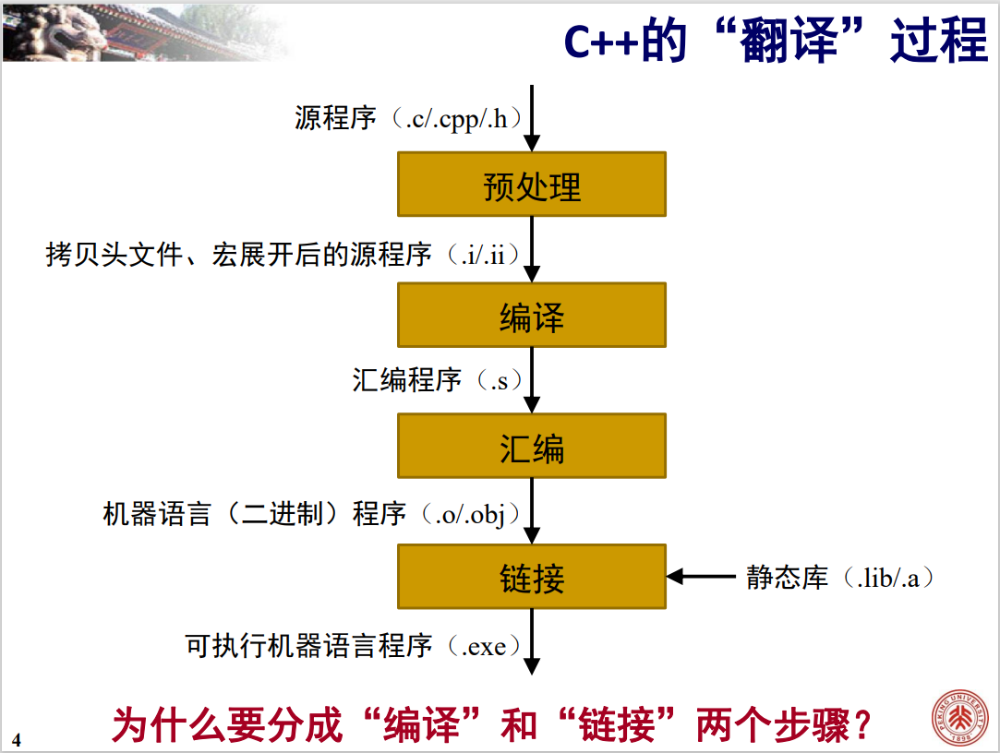

多文件的意义：拆分为多个代码文件后，当修改某个代码文件时，**只需重新编译改过的文件并重新链接**即可，整体的翻译效率得到提升。

根据后缀名，C++ 代码文件大致可以分为两类：
- `.h` 头文件：一般存放类型的定义和符号的声明（不涉及模板时）
    - 头文件只含声明，而只有定义才可以编译出二进制指令，因此单独编译头文件不会产生二进制指令
    - 头文件的作用仅在于被 `.cpp` 包含

- `.cpp` 实现文件：存放对应头文件声明的定义
    - 一般包含同名头文件
    - 每个实现文件一般对应一个翻译单元，这些翻译单元最后链接为整个程序
    - 项目一般会包含一个带有 `main()` 函数的特殊实现文件作为程序的执行入口。此实现文件一般只会包含必需的头文件


预处理指令：以 `#` 开头且以换行符为结尾的语句是预处理指令。预处理指令在编译之前完成特定的替换任务。

`#include` 预处理指令：把某个源文件直接插入到指令所在的位置。预处理时不断递归地展开 `#include` 指令。`include <头文件名>` 优先在系统库文件中查找，`include "文件名"` 优先在当前源文件所在的路径中查找。


条件编译可以避免**多次 `#include` 头文件导致重复**。

```c++
#if __cplusplus >= 201103L
int* ptr = nullptr;
#else
int* ptr = NULL;
#endif

// defined 运算符可以返回当前环境是否定义了某个宏
#if defined ONLINE_JUDGE
// #if defined 等价于 #ifdef
cout << "welcome";
#endif

// #if !defined 等价于 #ifndef
```


命名空间一般在 `.h` 头文件中，
```c++
namespace libA {
    constexpr double PI{3.14159265359};
}

int main() {
    using namespace libA;
    using libA::PI;
}
```

单一定义原则（One Definition Rule, ODR）： 一系列规定 C++ 如何处理声明和定义的规则，包括：
- 一个翻译单元中，允许出现变量、函数、类型、模板的**多次声明**，但只允许出现**至多一次定义**
- 一个翻译单元中，如果“ODR-使用”了一个符号（即需要取其地址的使用），那么这个符号至少要出现一次**定义**
- 整个程序中，**非内联**的符号最多只能出现一次定义

多文件中涉及同一个变量名的处理：
- 多个文件共享全局非只读变量：在一个文件中定义，其他文件中 `extern` 声明
- 多个文件共享全局只读变量：在一个文件中用 `extern const` 定义，其他文件中用 `extern const` 声明
- 多个文件各自使用全局只读变量：`const` 默认表示变量被各个文件分别管理


C++ 程序通过 `main` 函数的参数获取命令行参数，其形式为 `int main(int argc, char** argv)`。

- `argc`：代表启动程序时，命令行参数的个数。C++ 规定，可执行程序自身的文件名也算作一个命令行参数，因此 `argc` 至少是 `1`
- `argv`：指针数组，每个元素都是一个 C 风格字符串（argv[0] 是程序文件名） 


## 命令行编译（以 g++ 为例）

```bash
$ g++ ./main.cpp ./hello.cpp

# 也可以用 -o 指定编译结果存放的位置
$ g++ ./main.cpp ./hello.cpp -o ./main.exe
```

`g++` 通过文件后缀名判断其流程的起点：

|           后缀名           |                g++ 的行为                |
| :------------------------: | :--------------------------------------: |
| `.cpp` `.c++` `.cc` `.cxx` |      视为源文件，将预处理作为第一步      |
|           `.ii`            | 视为预处理之后的源文件，将编译作为第一步 |
|         `.s` `.S`          |      视为汇编文件，将汇编作为第一步      |
| 其他（一般为 `.o` `.obj`） |      视为对象文件，将链接作为第一步      |

`g++` 通过若干选项控制其流程的终点

|     选项     |                 g++ 的行为                 |
| :----------: | :----------------------------------------: |
|     `-E`     | 将预处理作为最后一步，得到预处理后的源文件 |
|     `-S`     |      将编译作为最后一步，得到汇编文件      |
|     `-c`     |      将汇编作为最后一步，得到对象文件      |
| 不含以上选项 |     将链接作为最后一步，得到可执行文件     |

`-E` 并不通过 `-o` 控制输出位置，它直接将结果输出到 `stdout` 上。可以用重定向运算符保存输出。

```bash
$ g++ ./hello.cpp -E > ./hellp.ii
$ g++ ./hello.ii -S -o ./hellp.s
$ g++ ./hello.s -c -o ./hellp.o
$ g++ ./hello.o -o ./hellp.exe
/hello.exe
```

构建（Build）：在一个项目中安排编译的顺序和时机，得到想要的结果（称为目标，Target）。

GNU Make，简称 Make，是一个经典的构建工具。Make 使用一种称为 Makefile 的文件来指明构建方法，Makefile 就是文件名为 `makefile` 的文件。

```shell
# Makefile
# 目标文件: 依赖文件0 依赖文件1 ...
#       生成命令
# 生成命令前是一个 Tab 字符

main.exe: f.o g.o main.o
    g++ f.o g.o main.o -o main.exe
f.o: f.cpp
    g++ f.cpp -c -o f.o
g.o: g.cpp
    g++ g.cpp -c -o g.o
main.o: main.cpp
    g++ main.cpp -c -c main.o
```

在命令行中执行 `make 目标文件` 完成构建。`Make` 可以通过每个文件的最后改动时间来确定一个目标是否需要重新生成，不用手动判断。


CMake 可以通过一个名为 `CMakeLists.txt` 的脚本生成 Makefile。

```shell
# CMakeLists.txt

# 规定最低 CMake 版本
cmake_minimum_required(VERSION 3.18.0)
# 指定项目名称
project(HelloWorld)
# 从 main.cpp f.cpp g.cpp 编译链接 得到一个名为 main 的可执行文件
add_executable(main main.cpp f.cpp g.cpp)
```

运行 `cmake` 命令可以根据 `CMakeLists.txt` 生成一系列文件，其中包含 `Makefile`。再运行 `make` 命令来生成可执行文件。

```shell
# CMakeLists.txt 的常用命令

# 从指定源文件编译出一个可执行文件
add_executable(tgt srcs...)

# 添加包含目录
tarfet_include_directories(tgt PRIVATE dirs...)

# 添加库查找目录
target_link_directories(tgt PRIVATE dirs...)

# 添加库链接（-l...）
target_link_libraries(tgt PRIVATE libs...)

# 设置编译选项
target_compile_options(tgt PRIVATE opts...)

# 设置其他编译属性（标准版本、输出路径等）
set_target_properties(tgt PROPERTIES prop1 val1 prop2 val2 ...)
```


# 流与文件

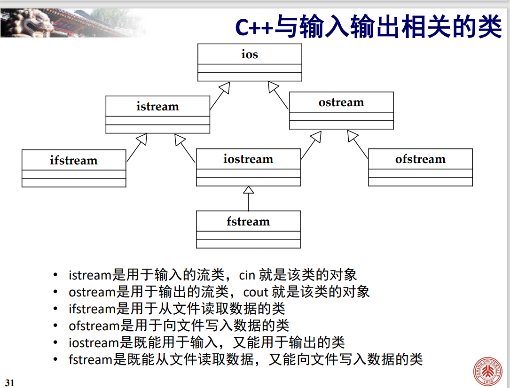

输入流对象 `cin` 与标准输入设备相连，对应于标准输入流。

输出流对象 `cout` 与标准输出设备相连，对应于标准输出流。

输出流对象 `cerr` 和 `clog` 与标准错误输出设备相连，前者不使用缓冲区，直接向显示器输出信息，后者将信息先存放在缓冲区，缓冲区满或刷新时才输出到显示器。


`istream` 类（或其基类）重载了 `oprator>>` 和 `operator bool`（这个重载是 `explicit` 的），从而实现了判断输入流结束。

`istream` 类的成员函数：

```c++
// 从输入流读取 bufSize-1 个字符到缓冲区 buf，或读到换行符为止
istream& getline(char* buf, int bufSize);

// 从输入流读取 bufSize-1 个字符到缓冲区 buf，或读到 delim 为止
istream& getline(char* buf, int bufSize, char delim);

// 把 c 放回输入流
istream& putback(char c);
```

输入输出重定向：

```c++
// 标准输出重定向到 test.txt
freopen("test.txt", "w", stdout);

// cin 被改为从 test.txt 中读取数据
freopen("test.txt", "r", stdin);
```

流操纵算子（定义在 `iomanip` 头文件）是一种函数。`iostream` 中对 `<<` 进行了 `ostream& operator<<(ostream& (*p)(ostream&));` 重载。

`dec` `oct` `hex` `setbase` 等流操纵算子可以设置整数流的基数。
`precision` 成员函数和 `setprecision` `setiosflags` 流操纵算子可以设置浮点数的精度。
`setw` 成员函数和 `width` 流操纵算子可以设置域宽。

## 文件操作

```c++
#include <fstream>
ofstream outFile("out.txt", ios::out|ios::binary);

// 也可以先默认构造创建对象 再用 open 成员函数打开
ofstream outFile;
outFile.open("out.txt", ios::out|ios::binary);
```

`ofstream` 是 `fstream` 中定义的类。`ios::out` 是打开并建立文件的选项。
    - `ios::out` 输出到文件，删除原有内容
    - `ios::app` 输出到文件，保留原有内容，总是在尾部添加
    - `ios::ate` 输出到文件，保留原有内容，在任意位置添加
    - `ios::binary` 以二进制文件格式打开

文件的读写指针标识文件操作的当前位置。读写操作在读写指针指向的位置进行。

```c++
ofstream fout("a.txt", ios::ate);

long location = fout.tellp();    // 取得写指针的位置
location = 10L;
fout.seekp(location);      // 将写指针移动到第 10 个字节处
fout.seekp(location, ios::beg);    // 从头数 location
fout.seekp(location, ios::cur);    // 从当前位置数 location
fout.seekp(location, ios::end);    // 从尾部数 location

// location 可以为负数
// istream 类的对应成员函数 seekg() 用法也类似
```

示例：将 `in.txt` 中的整数排序后，输出到 `out.txt`。

```c++
int main() {
    using namespace std;
    vector<int> v;
    ifstream srcFile("in.txt", ios::in);
    ofstream destFile("out.txt", ios::out);
    int x;
    while (srcFile >> x)
        v.push_back(x);
    ranges::sort(v);
    ranges::copy(v, ostream_iterator<int>(destFile, " "));
}
```


# 标准库设施

## `tuple` 类型

```c++
// 初始化
tuple<size_t, size_t, std::string> tp(1, 2, "str");
auto tp0 = make_tuple(1, 2, "str");

// 获取第 0 个数据 赋值为 3
get<0>(tp) = 3;

// 获取成员数量
tuple_size<decltype(tp)>::value;    // public constexpr static

// 获取成员类型
tuple_element<2, decltype(tp)>::type;

// 有字典序的比较运算符
```

## 随机数

随机数引擎是函数对象类。通过无参地调用一个随机数引擎对象，我们可以生成原始随机数。

```c++
// 以 default_random_engine 为例
default_random_engine eng;        // 默认种子
default_random_engine eng0(0);    // 指定种子

eng.seed(0);    // 重新设置种子

eng.min();
eng.max();
eng.discard(10);    // 丢弃10个随机数 即将引擎推进10步
```

一般来说，引擎的输出不能直接使用，因为正确转换随机数的范围较为困难。

随机数分布也是函数对象类。分布对象接受一个随机数引擎参数，将引擎生成的随机数映射到指定的分布。

```c++
uniform_int_distribution<unsigned> u(0, 9);    // 指定分布范围为闭区间 [0, 9]
default_random_engine e;
u(e);    // 获得符合分布的随机数
```

一个给定的随机数发生器（即给定的分布对象和引擎对象的组合）**一直会生成相同的随机数序列**（这对调试很有用）。将随机数发生器定义为**静态的**以避免错误地触发此特性。

```c++
unsigned getRandomNumber(int min, int max) {
    static uniform_int_distribution<unsigned> u(min, max);
    static default_random_engine e;
    return u(e);
}
```

**如果我们希望程序每次运行时都生成不同的随机数序列**，那么我们需要为随机数引擎指定种子（相同种子的引擎产生的随机数序列是一样的）。常见的方法是利用系统函数 `time`：

```c++
#include <ctime>

static default_random_engine e(time(0));
```

## `bitset`

```c++
// 初始化
bitset<32> b;    // 32位 每一位都为0
bitset<32> b(1u);  // 是unsigned long long值的低32位拷贝 超出位置0
bitset<64> b(str, pos, m, zero, one);  // 从std::string或C风格字符串的pos位置起m个字符的拷贝 字符只能为zero或one（默认为'0'和'1'）

// 操作
b.any();    // 是否存在置位
b.all();    // 所有位是否都置位
b.none();    // 所有位是否未置位
b.count();   // 置位的位数
b.size();    // b的位数

b.test(pos);  // 等价于 static_cast<bool>(b[pos]);
b.set(pos, v);    // b[pos] = v; v为bool值
b.set();    // 置位所有位

b.reset(pos);    // 复位
b.reset();    // 复位所有位
b.flip(pos);    // 翻转
b.filp();    // 翻转所有位

b.to_ulong();
b.to_ullong();    // 可能抛出overflow_error异常

b.to_string(zero, one);    // 字符串表示

os << b;
is >> b;    // io
```